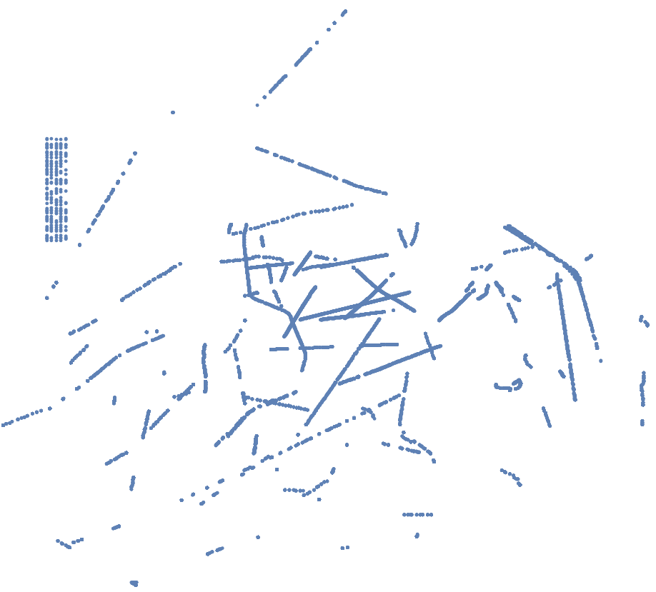

Let's apply some critical thinking skills for a moment.

We know that the flag format is not in the standard 'flag{' format.
This means that the flag is probably encoded in a very strange way
such that the regular format would be impossible to use. Along with the
challenge name and description, this would indicate strongly that
the flag will be found within some side-channel. This is a "BS" problem.

We know that Gus Naughton used to work in an industry related to avionics in the past. So this probably indicates something that has to do with planes.

We notice the data is refreshing so we set up a quick script to curl it every .1 seconds into a file. After ten minutes we see that the data is looping so we run uniq on it. (`loghdu.json`)

Then we just load each line as json and sort by timestamp. Gus doesn't do stupid crap like octals or hexadecimal so it's probably something to do with the flight *tracks*.

We then print out the 3d-coordinates of all of the planes and plot it using our Favorite Publicly Available Free 3-D Plotting Software.


Just with lat/long, no altitude (2D):



We notice a suspicious band of fake-looking data. Inspecting it closer we find that this plane's data is clearly fake.

<fakenews.json>
```json
{
  "category": "A0",
  "squawk": "7700",
  "flight": "WF1337",
  "lon": "-70.068680",
  "track": 64,
  "hex": "l0l3b3",
  "altitude": 6000,
  "vert_rate": 0,
  "messages": 3166,
  "lat": "40.933332",
  "speed": 200
}
```

So we dump just the positions of that plane, since that is probably how the flag is encoded and look at the positions in 2d:
<parse.py>
```python
import json

datas = open('loghdu.txt').readlines()
datas = map(json.loads, datas)
datas.sort(key=lambda snapshot:snapshot['now'])

prev_lon = 0
start_lon = 0
asdf = ''
for snapshot in datas:
    now = snapshot['now']
    snapshot = snapshot['aircraft']
    for ac in snapshot:
        if ac['hex'] == 'l0l3b3':
            lon = float(ac['lon'])
            lat = float(ac['lat'])
            print '{%f, %f},' % (lat, lon),

print asdf
```

Here's what the isolated data looks like for just the fake plane:


Scaling and flipping the image a bit, along with copious squinting, we can make out 'BUGSMASHERS'.


That makes sense since that's avionics lingo for a Cessna or something.

A cool idea for a future CTF would be to have to pinpoint where the scanner is located based on the flight names paths, signal strengths, etc.
