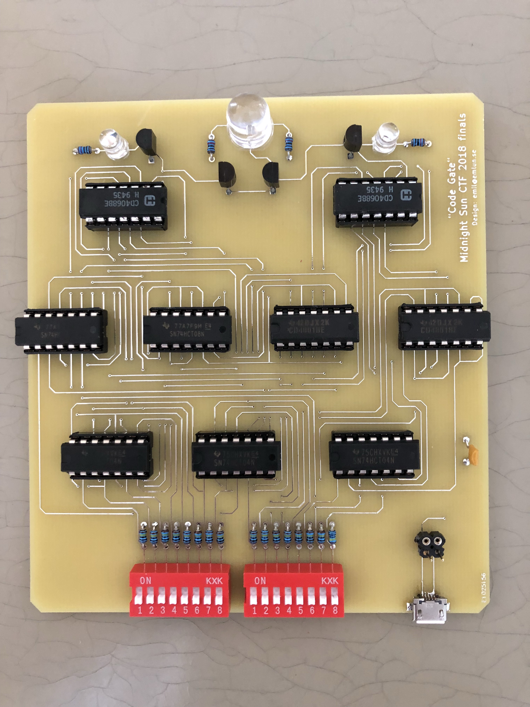
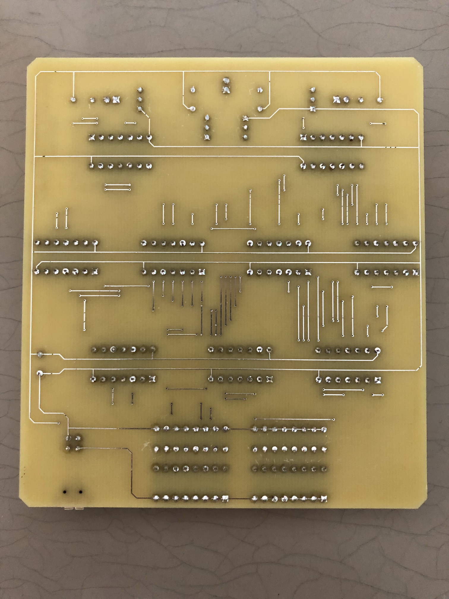

# Crazy Circuit Conundrum

**Category**: Reverse

161 Points

11 Solves

**Problem description**:
```
We are trying to break into their safe storage. We have exposed the panel of the lock mechanism and revealed a circuit. Go to the organizers table and see if you can unlock the entry to the storage.
```
---

This was a cool onsite challenge where you were given a circuitboard, and you had to figure out which setting of the 16 toggle switches was correct. Of course, you could brute force this and it would only take about 18 hours ;)

Anyways, I first took a front and back photo of the board:



Then, after struglging with GIMP I combined the two layers to better see the contacts on both sides of the PCB. I also went ahead and labeled the logic gates and enumerated each contact for easier analysis.


The general strategy is to start from the LEDs at the top and work backwards. Tracing the circuit connections it's essentially like a DFS to build up a list of binary logical relations for all the contacts. Here is what I got from tracing the left LED:

```
5   =   AND(1,2,3,4,6,7,8,9)
1   =   28
28  =   AND(26, 27)
26  =   74
78  =   NOT(73)
73  =   A
27  =   B
2   =   31
31  =   AND(29,30)
29  =   95
95  =   NOT(94)
94  =   M
30  =   G
3   =   24
24  =   AND(22,23)
22  =   E
23  =   O
4   =   21
21  =   AND(19,20)
20  =   K
19  =   90
90  =   NOT(89)
89  =   H
6   =   34
34  =   AND(32, 33)
32  =   74
74  =   NOT(73)
73  =   A
33  =   78
78  =   NOT(77)
77  =   C
7   =   35
35  =   AND(133,134)
133 =   33
134 =   42
8   =   43
43  =   AND(41,42)
41  =   86
86  =   NOT(85)
85  =   D
42  =   105
105 =   NOT(104)
104 =   P
9   =   40
40  =   AND(38,39)
38  =   F
39  =   41
```

So, I wrote a quick and dirty Python script to parse this into an AST and evaluate it. Then, I fed it into Z3, which spit out:

```
And(Not(A),
    B,
    Not(M),
    G,
    E,
    O,
    Not(H),
    K,
    Not(C),
    Not(P),
    Not(D),
    F)
A = 1
B = 0
C = 1
D = 1
E = 0
F = 0
G = 0
H = 1
I = ?
J = ?
K = 0
L = ?
M = 1
N = ?
O = 0
P = 1
10110001??0?1?01
```

Funny, we used Z3 to solve a *physical* boolean circuit. :P

That means all but 4 of the switches are solved, which means there's only 16x2 (2 because all switches could be inverted) combinations to try. That was enough to solve the problem.
