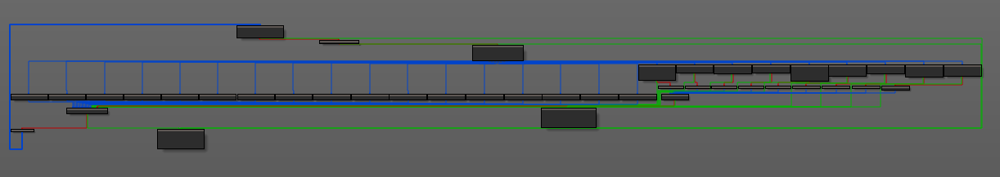

# hfs-mbr

**Category**: Reversing

213 Points

60 Solves

**Problem description**:
We made a military-grade secure OS for HFS members. Feel free to beta test it for us! 

---

This was a very easy realmode reversing challenge.

```
$ nc hfs-os-01.play.midnightsunctf.se 31337
WARNING: Image format was not specified for '/tmp/tmp.c28Y8A5sMZ' and probing guessed raw.
         Automatically detecting the format is dangerous for raw images, write operations on block 0 will be restricted.
         Specify the 'raw' format explicitly to remove the restrictions.
SeaBIOS (version rel-1.12.1-0-ga5cab58e9a3f-prebuilt.qemu.org)


iPXE (http://ipxe.org) 00:03.0 C980 PCI2.10 PnP PMM+00F91410+00EF1410 C980


Booting from Hard Disk..
.

[HFS SECURE BOOT] Loading  ...
.-. .-.----.----.   .-.   .-.----..----.
| {_} | {_{ {__     |  `.'  | {}  | {}  }
| { } | | .-._} }   | |\ /| | {}  | .-. \
`-' `-`-' `----'    `-' ` `-`----'`-' `-'
Enter the correct password to unlock the Operating System
[HFS_MBR]>
```

We are given a disk image that is booted by Qemu. Since we are BIOS booting this means our MBR (first sector, 512bytes on disk) will be copied to 0x7c00 and execution will begin there. It is pretty typical for this code to simply read more data from disk and jump to it. That is exactly what is happening in this challenge.

```
seg000:7C21 proc near bootstrap
seg000:7C21 mov     ax, 202h
seg000:7C24 mov     cx, 4
seg000:7C27 xor     dh, dh
seg000:7C29 mov     dl, 80h
seg000:7C2B mov     bx, 7E00h
seg000:7C2E int     13h             ; DISK - READ SECTORS INTO MEMORY
seg000:7C2E                         ; AL = number of sectors to read, CH = track, CL = sector
seg000:7C2E                         ; DH = head, DL = drive, ES:BX -> buffer to fill
seg000:7C2E                         ; Return: CF set on error, AH = status, AL = number of sectors read
seg000:7C30 jmp     bx
seg000:7C30 endp
```

Note the usage of CHS addressing. CHS addressing is an old way of addressing sectors on disk by their cylinder, head, and sector. The calculation to translate from CHS to LBA (linear) addresses is well-known, but the geometry of the hard drive must be known. Anyways, this is reading from CHS 0,0,4 which translates to sector 3 (0x600) on disk. Let's load that into IDA.

The most challenging part of these challenges is properly setting up segments and xrefs in IDA, so that the code becomes readable. A short summary of this stage of code is that it simply takes input from keyboard and checks whether the inputted character is in the right position. It does this by doing a switch statement with 26 case (one per letter) and tracking how many characters have been entered so far. When we setup this switch idiom in IDA nicely, we actually get quite nice output.



The check is quite simple, and it is trivial to reverse. Once the right password is given the program loads the next stage of the challenge.

```
Enter the correct password to unlock the Operating System
[HFS_MBR]> sojupwner
sojupwner
Correct password! Press any key to load HFS-OS!
FreeDOS kernel 2042 (build 2042 OEM:0xfd) [compiled May 11 2016]
Kernel compatibility 7.10 - WATCOMC - FAT32 support

(C) Copyright 1995-2012 Pasquale J. Villani and The FreeDOS Project.
All Rights Reserved. This is free software and comes with ABSOLUTELY NO
WARRANTY; you can redistribute it and/or modify it under the terms of the
GNU General Public License as published by the Free Software Foundation;
either version 2, or (at your option) any later version.
C: HD1, Pri[ 1], CHS=    0-1-1, start=     0 MB, size=     9 MB
[HFS SECURE SHELL] Here is your flag for HFS-MBR: midnight{w0ah_Sh!t_jU5t_g0t_RE
ALmode}
```

I am pretty confident that you don't actually need to reverse this binary at all. You can solve it just by brute-forcing each character one at a time, since the program halts as soon as the first incorrect character is given.
