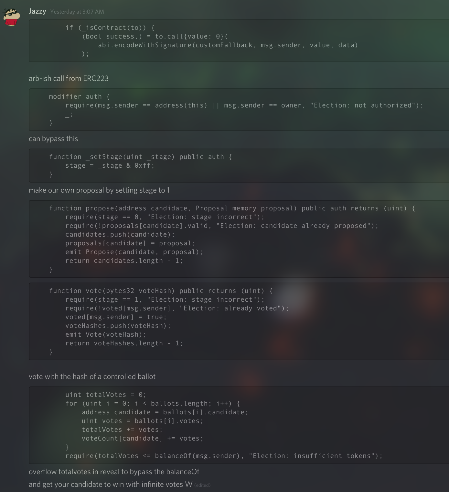

# Election

TLDR:

- One issue was to the call to `proposal()` from the customFallback had a different method signature, but the way arguments are encoded in the ABI, you could control the `value` in the customFallback to control the offset for the Proposal struct in `propose()`
- Then you can create an arbitrary Proposal in the data parameter.
- Look at `add_proposal()` in [exploit.js](./exploit.js) for more details. 
- I also modified the Election.sol and added a couple helper functions to encode the parameters.
