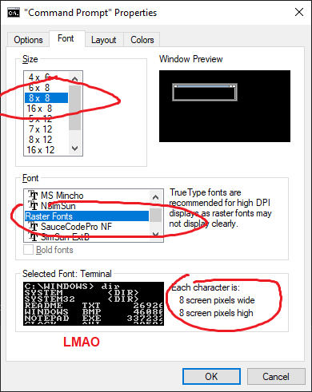
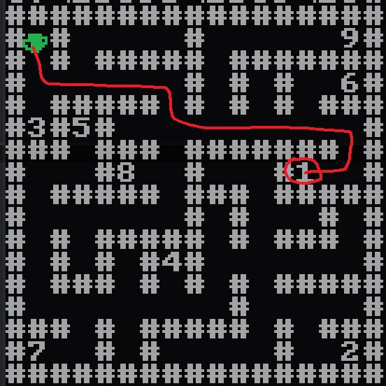

# sprint

Solved by tkoa and cts

Basically the binary implements a virtual machine by printf format strings

```c
int __cdecl main(int argc, const char **argv, const char **envp)
{
  char *pc; // [rsp+40h] [rbp-90h]
  char *r1; // [rsp+48h] [rbp-88h]
  __int64 r2; // [rsp+50h] [rbp-80h]
  __int64 r3; // [rsp+58h] [rbp-78h]
  __int64 r4; // [rsp+60h] [rbp-70h]
  __int64 r5; // [rsp+68h] [rbp-68h]
  __int64 r6; // [rsp+70h] [rbp-60h]
  __int64 r7; // [rsp+78h] [rbp-58h]
  __int64 r8_; // [rsp+80h] [rbp-50h]
  __int64 r9_; // [rsp+88h] [rbp-48h]
  char *mem; // [rsp+98h] [rbp-38h]

  mem = (char *)mmap((void *)0x4000000, 0x4000000uLL, 3, 0x22, -1, 0LL);
  memcpy(mem, fmtStrArr, 0xF134uLL); // map virtual machine's code and data
  r2 = 0LL;
  r3 = 0LL;
  r4 = 0LL;
  r5 = 0LL;
  r6 = 0LL;
  r7 = 0LL;
  r8_ = 0LL;
  r9_ = 0LL;
  pc = mem;
  r1 = mem;
  puts("Input password:");
  __isoc99_scanf("%255s", mem + 0xE000);
  while ( pc != mem + 0xFFFE )
    sprintf(
      (char *)0x6000000,
      pc,
      &nullstr,
      0LL,
      &pc,
      0x6000000LL,
      *(unsigned __int16 *)r1,
      r1,
      &r1,
      r2,
      &r2,
      r3,
      &r3,
      r4,
      &r4,
      r5,
      &r5,
      r6,
      &r6,
      r7,
      &r7,
      r8_,
      &r8_,
      r9_,
      &r9_);
  if ( *((_WORD *)mem + 0x7400) )
    printf("Flag: %s\n", mem + 0xE800);
  return 0;
}
```

fmtStrArr is this huge array of format strings

```
.rodata:0000000000002020 M               db '%1$00038s%3$hn%1$65498s%1$28672s%9$hn',0
.rodata:0000000000002020                                         ; DATA XREF: main+46↑o
.rodata:0000000000002046 a100074s3Hn1654 db '%1$00074s%3$hn%1$65462s%1$*8$s%7$hn',0
.rodata:000000000000206A a100108s3Hn1654 db '%1$00108s%3$hn%1$65428s%1$1s%6$hn',0
.rodata:000000000000208C a100149s3Hn1653 db '%1$00149s%3$hn%1$65387s%1$*8$s%1$2s%7$hn',0
.rodata:00000000000020B5 a100183s3Hn1653 db '%1$00183s%3$hn%1$65353s%1$1s%6$hn',0
.rodata:00000000000020D7 a100218s3Hn1653 db '%1$00218s%3$hn%1$65318s%1$2s%11$hn',0
.rodata:00000000000020FA a100264s3Hn1652 db '%1$00264s%3$hn%1$65272s%1$*10$s%1$*10$s%17$hn',0
.rodata:0000000000002128 a100310s3Hn1652 db '%1$00310s%3$hn%1$65226s%1$28672s%1$*16$s%7$hn',0
.rodata:0000000000002156 a100347s3Hn1651 db '%1$00347s%3$hn%1$65189s%1$*5$s%15$hn',0
.rodata:000000000000217B a14C100419s2C4S db '%14$c%1$00419s%2$c%4$s%1$65499s%3$hn',0
.rodata:00000000000021A0 a100430s3Hn1651 db '%1$00430s%3$hn%1$65106s%1$*10$s%1$*10$s%13$hn',0
.rodata:00000000000021CE a100468s3Hn1650 db '%1$00468s%3$hn%1$65068s%1$65519s%7$hn',0
.rodata:00000000000021F4 a100505s3Hn1650 db '%1$00505s%3$hn%1$65031s%1$*12$s%6$hn',0
.rodata:0000000000002219 a100543s3Hn1649 db '%1$00543s%3$hn%1$64993s%1$65520s%7$hn',0
...
```

Basically, each format string is 1 "instruction", and if you break down one of them, each instruction is composed of several "microinstructions"

For example let's take `%1$00038s%3$hn%1$65498s%1$28672s%9$hn`

microinstructions:

- `%1$00038s`. %1 is empty string so the point of this is just to add 38 to the internal counter in printf that tracks how many characters have been written so far, which i call the "accumulator". (the accumulator is set to 0 at the beginning of each printf call (macroinstruction), of course)
- `%3$hn`. write the chars written counter (accumulator) to arg 3, which is the pc. pc is just pointer to somewhere in the fmtStrArr which is analogous to the code section. so the previous instruction set the accumulator, this instruction selects the nextPc.
- `%1$65498s`. add 65498 to accumulator, which is the twos complement of 38, effectively zeroing the accumulator
- `%1$28672s`. add 28672 to accumulator
- `%9$hn`. write accumulator to pointer arg 9 (&r2)

So this instruction basically does `pc=38; r2=28672`

We wrote a disassembler that broke down each macroinstruction into its constituent microinstructions, parsed the μinstrs, then symbolically execute and pattern match the μinstr sequences to form a coherent macroinstruction disassembly. This is in `sprint.py`. Here is what that looks like

```
(0, 'pc=38; r2=28672;')
(38, 'pc=74; r1=r2;')
(74, 'pc=108; *r1=1;')
(108, 'pc=149; r1=r2+2;')
(149, 'pc=183; *r1=1;')
(183, 'pc=218; r3=2;')
(218, 'pc=264; r6=r3+r3;')
(264, 'pc=310; r1=r6+28672;')
(310, 'pc=347; r5=*r1;')
(347, 'pc=(r5?420:0)+384;')
(384, 'pc=430; r4=r3+r3;')
(430, 'pc=468; r1=-17;')
(468, 'pc=505; *r1=r4;')
(505, 'pc=543; r1=-16;')
(543, 'pc=580; r5=*r1;')
(580, 'pc=(r5?187:0)+617;')
(617, 'pc=663; r6=r4+r4;')
(663, 'pc=709; r1=r6+28672;')
(709, 'pc=743; *r1=1;')
(743, 'pc=789; r4=r4+r3;')
(789, 'pc=430;')
(804, 'pc=847; r3=r3+1;')
(847, 'pc=(r3?-666:0)+884;')
(884, 'pc=922; r2=-8192;')
(922, 'pc=957; r3=0;')
(957, 'pc=993; r1=r2;')
(993, 'pc=1030; r4=*r1;')
(1030, 'pc=(r4?15:0)+1067;')
(1067, 'pc=1185;')
(1082, 'pc=1129; r3=r3-1;')
(1129, 'pc=1170; r2=r2+1;')
(1170, 'pc=957;')
(1185, 'pc=1232; r6=r3+254;')
(1232, 'pc=(r6?15:0)+1269;')
(1269, 'pc=1334;')
(1284, 'pc=1319; r9=5;')
(1319, 'pc=5081;')
(1334, 'pc=1368; r2=0;')
(1368, 'pc=1403; r3=0;')
(1403, 'pc=1441; r1=-3840;')
(1441, 'pc=1478; r4=*r1;')
(1478, 'pc=1513; r5=1;')
(1513, 'pc=1548; r9=0;')
(1548, 'pc=1593; r1=r2-8192;')
(1593, 'pc=1630; r6=*r1;')
(1630, 'pc=(r6?15:0)+1667;')
(1667, 'pc=3479;')
(1682, 'pc=1723; r2=r2+1;')
(1723, 'pc=1770; r7=r6-117;')
(1770, 'pc=(r7?54:0)+1807;')
(1807, 'pc=1846; r6=-16;')
(1846, 'pc=2373;')
(1861, 'pc=1908; r7=r6-114;')
(1908, 'pc=(r7?50:0)+1945;')
(1945, 'pc=1980; r6=1;')
(1980, 'pc=2373;')
(1995, 'pc=2042; r7=r6-100;')
(2042, 'pc=(r7?51:0)+2079;')
(2079, 'pc=2115; r6=16;')
(2115, 'pc=2373;')
(2130, 'pc=2177; r7=r6-108;')
(2177, 'pc=(r7?54:0)+2214;')
(2214, 'pc=2253; r6=-1;')
(2253, 'pc=2373;')
(2268, 'pc=2303; r5=0;')
(2303, 'pc=2338; r6=0;')
(2338, 'pc=2373; r9=1;')
(2373, 'pc=2419; r4=r4+r6;')
(2419, 'pc=2457; r1=-17;')
(2457, 'pc=2494; *r1=r4;')
(2494, 'pc=2532; r1=-16;')
(2532, 'pc=2569; r6=*r1;')
(2569, 'pc=(r6?823:0)+2606;')
(2606, 'pc=2652; r1=r4-4096;')
(2652, 'pc=2689; r6=*r1;')
(2689, 'pc=2727; r1=-17;')
(2727, 'pc=2764; *r1=r6;')
(2764, 'pc=2802; r1=-16;')
(2802, 'pc=2836; *r1=0;')
(2836, 'pc=2874; r1=-17;')
(2874, 'pc=2911; r6=*r1;')
(2911, 'pc=2957; r6=r6+r6;')
(2957, 'pc=3003; r1=r6+28672;')
(3003, 'pc=3040; r6=*r1;')
(3040, 'pc=(r6?267:0)+3077;')
(3077, 'pc=3120; r6=r3+1;')
(3120, 'pc=3166; r1=r6-3838;')
(3166, 'pc=3203; r6=*r1;')
(3203, 'pc=3249; r6=r6+r4;')
(3249, 'pc=(r6?43:0)+3286;')
(3286, 'pc=3329; r3=r3+1;')
(3329, 'pc=1548;')
(3344, 'pc=3379; r5=0;')
(3379, 'pc=3414; r9=2;')
(3414, 'pc=1548;')
(3429, 'pc=3464; r9=4;')
(3464, 'halt;')
(3479, 'pc=(r5?15:0)+3516;')
(3516, 'pc=5081;')
(3531, 'pc=3578; r6=r3-9;')
(3578, 'pc=(r6?15:0)+3615;')
(3615, 'pc=3680;')
(3630, 'pc=3665; r9=3;')
(3665, 'pc=5081;')
(3680, 'pc=3714; r2=0;')
(3714, 'pc=3749; r3=0;')
(3749, 'pc=3795; r4=r2-39;')
(3795, 'pc=(r4?15:0)+3832;')
(3832, 'pc=4987;')
(3847, 'pc=3882; r5=4;')
(3882, 'pc=3917; r4=0;')
(3917, 'pc=3963; r4=r4+r4;')
(3963, 'pc=4009; r4=r4+r4;')
(4009, 'pc=4055; r1=r3-8192;')
(4055, 'pc=4092; r6=*r1;')
(4092, 'pc=4139; r7=r6-117;')
(4139, 'pc=(r7?15:0)+4176;')
(4176, 'pc=4632;')
(4191, 'pc=4238; r7=r6-114;')
(4238, 'pc=(r7?58:0)+4275;')
(4275, 'pc=4318; r4=r4+1;')
(4318, 'pc=4632;')
(4333, 'pc=4380; r7=r6-100;')
(4380, 'pc=(r7?58:0)+4417;')
(4417, 'pc=4460; r4=r4+2;')
(4460, 'pc=4632;')
(4475, 'pc=4522; r7=r6-108;')
(4522, 'pc=(r7?58:0)+4559;')
(4559, 'pc=4602; r4=r4+3;')
(4602, 'pc=4632;')
(4617, 'pc=5081;')
(4632, 'pc=4675; r3=r3+1;')
(4675, 'pc=4722; r5=r5-1;')
(4722, 'pc=(r5?-842:0)+4759;')
(4759, 'pc=4804; r1=r2-3828;')
(4804, 'pc=4841; r5=*r1;')
(4841, 'pc=4886; r1=r2-6144;')
(4886, 'pc=4931; *r1=r5+r4;')
(4931, 'pc=4972; r2=r2+1;')
(4972, 'pc=3749;')
(4987, 'pc=5032; r1=r2-6144;')
(5032, 'pc=5066; *r1=0;')
(5066, 'halt;')
(5081, 'pc=5119; r1=-6144;')
(5119, 'pc=5153; *r1=0;')
(5153, 'halt;')
```

At this point it is totally feasible to reverse the VM but I am a stupid lazy idiot with no attention span. So instead i write an insanely quick and dirty transpiler (see `sprint2.py`)to x86 so i can put it inside IDA and press F5 LMAO. it turns each instruction into something like this

```
loc_108:
xor eax, eax ; clear accumulator
add rax, r8 ; acc += r8
add rax, 2 ; acc += 2
mov rdi, rax ; r1 = acc
mov rbx, 108 ; debugging comment label, this code was transpiled from format string at pc=108
nop ; nop so its easier on the eyes in ida lmao
```

So then i put this in IDA, also loaded the data section that was mapped by the `memcpy` at the start, setup the proper segments and whatever, and the press F5

```c
__int64 sub_0()
{
  __int64 v0; // r9
  __int64 i; // r10
  _QWORD *v2; // r8
  __int64 v3; // r9
  __int64 v4; // r8
  __int64 v5; // r9
  __int64 v6; // r10
  __int64 v7; // r11
  __int64 v8; // r12
  __int64 v9; // r12
  __int64 result; // rax
  __int64 v11; // r8
  __int64 v12; // r9
  __int64 v13; // r11
  __int64 v14; // r10
  __int64 v15; // r12

  qword_7000[0] = 1i64;
  *(_QWORD *)((char *)qword_7000 + 2) = 1i64;
  v0 = 2i64;
  do
  {
    if ( !*(_QWORD *)((char *)qword_7000 + 2 * v0) )
    {
      for ( i = 2 * v0; ; i += v0 )
      {
        unk_FFFFFFFFFFFFFFEF = i;
        if ( unk_FFFFFFFFFFFFFFF0 )
          break;
        *(_QWORD *)((char *)qword_7000 + 2 * i) = 1i64;
      }
    }
    ++v0;
  }
  while ( v0 );
  v2 = (_QWORD *)&unk_FFFFFFFFFFFFE000;
  v3 = 0i64;
  while ( *v2 )
  {
    --v3;
    v2 = (_QWORD *)((char *)v2 + 1);
  }
  if ( v3 != -254 )
    goto LABEL_47;
  v4 = 0i64;
  v5 = 0i64;
  v6 = unk_FFFFFFFFFFFFF100;
  v7 = 1i64;
  while ( 1 )
  {
    v8 = *(_QWORD *)(v4 - 0x2000);
    if ( !v8 )
      break;
    ++v4;
    switch ( v8 )
    {
      case 'u':
        v9 = -16i64;
        break;
      case 'r':
        v9 = 1i64;
        break;
      case 'd':
        v9 = 16i64;
        break;
      case 'l':
        v9 = -1i64;
        break;
      default:
        v7 = 0i64;
        v9 = 0i64;
        break;
    }
    v6 += v9;
    unk_FFFFFFFFFFFFFFEF = v6;
    if ( unk_FFFFFFFFFFFFFFF0 )
      return 4i64;
    unk_FFFFFFFFFFFFFFEF = *(_QWORD *)(v6 + 0xFFFFF000);
    unk_FFFFFFFFFFFFFFF0 = 0i64;
    if ( *(_QWORD *)((char *)qword_7000 + 2 * unk_FFFFFFFFFFFFFFEF) )
    {
      v7 = 0i64;
    }
    else if ( !(v6 + *(_QWORD *)(v5 - 0xEFD)) )
    {
      ++v5;
    }
  }
  if ( v7 && v5 == 9 )
  {
    v11 = 0i64;
    v12 = 0i64;
    while ( v11 != 39 )
    {
      v13 = 4i64;
      v14 = 0i64;
      do
      {
        v14 *= 4i64;
        v15 = *(_QWORD *)(v12 - 0x2000);
        if ( *(_QWORD *)(v12 - 0x2000) != 'u' )
        {
          switch ( v15 )
          {
            case 'r':
              ++v14;
              break;
            case 'd':
              v14 += 2i64;
              break;
            case 'l':
              v14 += 3i64;
              break;
            default:
              goto LABEL_47;
          }
        }
        ++v12;
        --v13;
      }
      while ( v13 );
      *(_QWORD *)(v11 - 0x1800) = v14 + *(_QWORD *)(v11 - 0xEF4);
      ++v11;
    }
    result = 0i64;
    unk_FFFFFFFFFFFFE827 = 0i64;
  }
  else
  {
LABEL_47:
    result = 0i64;
    unk_FFFFFFFFFFFFE800 = 0i64;
  }
  return result;
}
```

the decompilation is baaasically correct but you need to squint at some parts. tl;dr there is a 16x16 maze encoded in the data section, basically if the number is prime at that position in the array then u can walk there, otherwise composite number at that spot is a "wall". also you start at 1,1 and you need to go thru some "checkpoints" in order, and looks like they will turn your sequence of steps u,d,l,r into a flag by bit packing (since udlr is 2 bits, they just repack this as the flag lol)

so then i wrote a thing in python to draw the maze in ascii (see `maze.py`)

NOW for the BIG brain trick, guess what




SO now the obvious next step is to write the simple BFS to solve the maze right??

Wrong, i'm an idiot and at 4am i'm too tired to write BFS algorithm, so i just solved this maze by hand LOL

Actually what we did was tkoa had notepad open and I would read the steps out loud as i drew on the maze picture in MSpaint, and tkoa would write them down, basically we are playing Simon Says.

WE did not want some stupid debugging nightmare and get led down a rabbit hole, so after each waypoint we would enter our input into the program and trace it to make sure our hypothesis is correct. specifically we use ld_preload to hook `sprint` and log which the format string, so we can **trace the execution of the vm** :) this is in `big_ld_meme.c`

in the transpiled bin's hexrays , we got this
```c
if ( *(_QWORD *)((char *)qword_7000 + 2 * unk_FFFFFFFFFFFFFFEF) )
{
  v7 = 0i64;
}
else if ( !(v6 + *(_QWORD *)(v5 - 0xEFD)) )
{
  ++v5;                                     // waypoint hit
}
```

which correspond to this

```
seg000:00000000000004FE
seg000:00000000000004FE                       waypoint_hit:
seg000:00000000000004FE 008 31 C0             xor     eax, eax
seg000:0000000000000500 008 4C 01 C8          add     rax, r9
seg000:0000000000000503 008 48 83 C0 01       add     rax, 1
seg000:0000000000000507 008 49 89 C1          mov     r9, rax
seg000:000000000000050A 008 BB D6 0C 00 00    mov     ebx, 0CD6h ; this was transpiled from format string at 0x400CD6
seg000:000000000000050F 008 90                nop
```

wow, amazing, so smart, thanks to my genious idea of adding the comment, now i know which format string this is from!!! so we do the ld_preload trace meme (see `log.txt`) and then i search for 0x400cd6, and amazingly we did in fact hit this branch with our input for our first waypoint.



Anyways then we kept playing simon says and solving the maze by hand because we are stupid, and each time at waypoint N we make sure we had N hits of 0x400cd6 virtual instruction. Then magically at the end we had the flag, simply incredible.

```
ddrrrrrrddrrrrrrrrddllrruullllllllddddllllllddddrrrrrrrruurrddrrddrrlluulluullddlllllllluuuurrrrrruuuuuulllllldduurrrrrrddddddllllllddddrrrrrruuddlllllluuuuuurruuddllddrrrrrruuuurrrrrruurrllddllllllddddllllllddddrrddllrruulluuuurrrrrruullrruurruuuurrrrrr

CTF{n0w_ev3n_pr1n7f_1s_7ur1ng_c0mpl3te}

```
