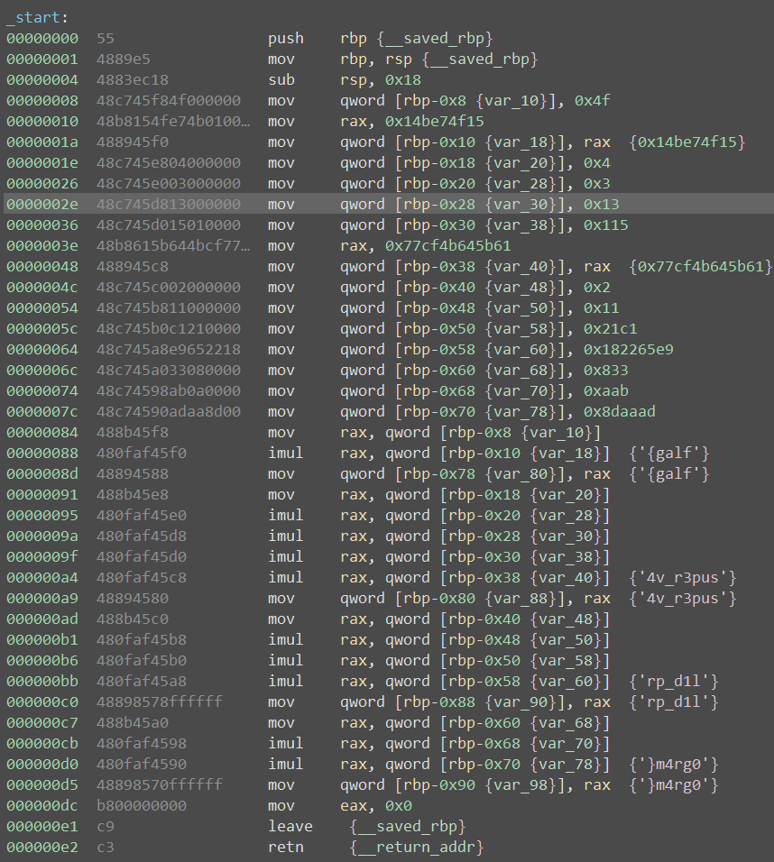

# Baby Mult

Solved by cts

They give you a txt file which is just shellcode bytes. The code makes the flag in rax but does not print it. So if you just put it into binaryninja it will annotate the constants, solving the challenge.

