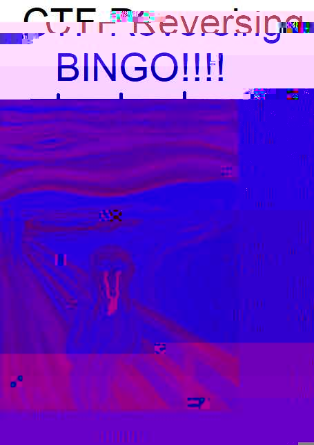

# Take it easy

```
x86 was a mistake, and one of its mistakes is in this binary. If you can find it, maybe you'll be rewarded with a flag. Hmm, maybe the title is also a key of some sort...

By @yossarian from Trail of Bits

250 pts
```

Obligatory bingo board



Hmm, guess the bingo card is having some trouble today, no worries let's proceed

Also, in this write up, my inner guess god will comment in bullets, for example

- like this

### Step 1.

They give you a wireshark binary, and it's like 8MB. That's huge and reversing will be terrible.

- Diff it because the challenge author probably just tacked on the challenge bit onto the existing binary

But what to diff against???

- Lmao, its probably just the one they had on their harddrive... bet you it's just the generic binary from Ubuntu 18.04 apt repo

Guess what, turns out the wireshark we had on my server from Ubuntu 18.04 apt repo is the exact same file size and version... but some bytes are changed

Comparing the bytes, they're all in instructions, and don't result in semantic difference.

Yeah so it just so happened, that like few weeks ago sampriti linked this blog in our groupchat about hiding information in x86 instruction encodings. it's this github repo

https://github.com/woodruffw/steg86

- And guess what? The owner of the repo is also the challenge author. So this is actually a **big brain ctf strategy: before you try to solve the challenge at all, just google the challenge author, stalk his blog and github because 30%+ of the time you will just get a solve script LOL** Pro guess god strats always win.

So yeah I downloaded this and I ran it, the magic is correct, but oh no? The version number is wrong, it got 69 instead of the expected one??? Wow, 69, very cool. So I just commented it out and recompiled it lol. And I saved the output to fuck.out

### Step 2.

Oh no, our fuck.out is not looking like a legit data!!! What ever will we do??

Well the first part of the fuck.out looks like:

```
Offset(h) 00 01 02 03 04 05 06 07 08 09 0A 0B 0C 0D 0E 0F

00000000  58 4F 52 21 A7 97 AD C1 58 5F 18 67 11 09 52 20  XOR!§—.ÁX_.g..R 
00000010  59 4F 52 20 58 4E 52 21 A7 94 52 62 58 6F 44 39  YOR XNR!§”RbXoD9
00000020  44 57 46 01 44 55 4E 05 7A 6F 74 11 08 7B 62 0D  DWF.DUN.zot..{b.
```

- Hmmmm XOR! ??? Very interesting, do you want me to XOR it ???

In fact yes, use your guess god powers, fuck.out is actually a JPEG but xored with the key `XOR!`. (See xorit.py)


### Step 3.

Well I opened the jpeg but there is no flag to be seen!!! I wonder what it is??

- Clearly now we are doing image stego :deepfried laughing emoji:

Yes but what did they used to hide it?? I checked stegsolve and it's not LSBs or anything like that!

- steghide haHAAAa

Yes, truly all paths lead to steghide. At the end of every road, river, and sea is steghide. You can salt the earth and raze the skies but you will never vanquish steghide. steghide is like a bad dream you can't forget. at the end of days, humanity long washed away and forgotten, as the world sighs a last whimper, all returns to nothing, and what will be left, is steghide 0.5.1

BUT WHAT IS THE STEGHIDE PASSWORD??

- CHALLENGE TITLE haHAaa

Yes, it's really the challenge title `take-it-easy`

`flag{immanuel-kant-says-wear-a-mask}`

Yea well i KANT take it anymore!

### Epilogue

```
[7:45 PM] AAA: amazing
[7:47 PM] AAA: csaw created new bingo boards for every category
[7:48 PM] BBB: "steg web"
[7:48 PM] CCC: we need a bingo board of bingo boards
[7:48 PM] BBB: "steg rev"
[7:54 PM] DDD: creative challenges get creative writeups
```
