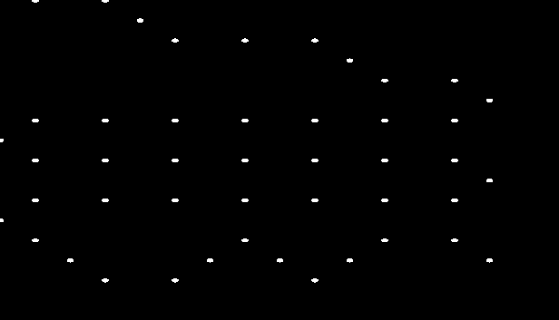
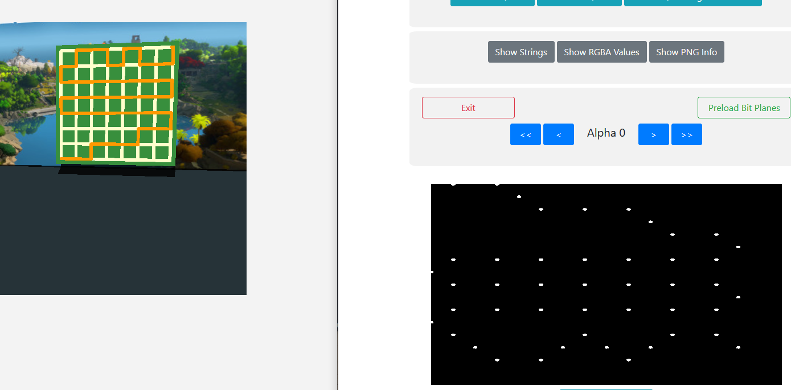
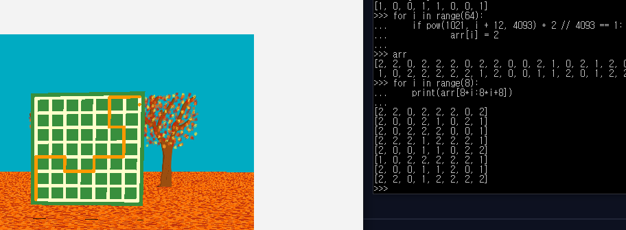

# The Watness III

Another The Watness challenge! The goal is to solve line-drawing puzzles, like in the game "The Witness". I recommend you to play The Witness first :D

The answer-checking logic is hiddne in the shader code.

```js
96: e => {
    e.exports = {
        sourceCode: "#ifdef GL_ES\nprecision highp float;...",
        uniforms: {
            time: {
                variableType: "float",
                variableName: "time"
            },
            dt: {
                variableType: "float",
                variableName: "dt"
            },
            resolution: {
                variableType: "vec2",
                variableName: "resolution"
            },
            loopback: {
                variableType: "ivec4",
                variableName: "loopback"
            },
            mouse: {
                variableType: "vec2",
                variableName: "mouse"
            },
            footLocation: {
                variableType: "vec2",
                variableName: "footLocation"
            },
            introImage: {
                variableType: "sampler2D",
                variableName: "introImage"
            },
            treeImage: {
                variableType: "sampler2D",
                variableName: "treeImage"
            },
            shrubImage: {
                variableType: "sampler2D",
                variableName: "shrubImage"
            }
        },
        consts: {}
    }
}
```

If you beautify the code (`sourceCode`) then you can check the `main` function.

```c++
void main() {
  vec4 Cq = c;
  int CP = K(121.);
  int AU;
  if (CP == 0) AU = 8;
  if (CP == 1) AU = 8;
  if (CP == 2) AU = s;
  vec2 Bo = Br(AU);
  vec2 Cr = By();
  vec2 CF = CE();
  bool AA = N(120.);
  z Cs;
  if (CP == 0) Cs = Cl(Bo);
  if (CP == 1) Cs = Ce(Bo);
  if (CP == 2) Cs = CN(Bo);
  Q(100., Bo.x / 2. + 0.5, 1.) Q(100. + 1., Bo.y / 2. + 0.5, 1.) Q(102., Cr.x, 1.) Q(102. + 1., Cr.y, 1.) Q(104., CF.x, 2. * X) Q(104. + 1., CF.y, X) int Ct = 0;
  for (int AO = 0; AO < 100; AO++) {
    ivec3 AX = M(int(0.) + AO);
    if (AX == ivec3(255, 255, 1)) {
      Ct = AO;
      break;
    }
  }
  for (int AO = 0; AO < 100; AO++) {
    ivec3 AX = M(int(0.) + AO);
    if (AX.z == 0) {
      V(0. + float(AO), ivec3(255, 255, 1))
    } else if (AO == 0) {
      V(0. + float(AO), ivec3(0, 0, 1));
    } else if (Cs.AA) {
      if (AO == Ct) {
        ivec2 Cu;
        if (!Cs.AB && AS(Bo, AU, Cu) && Ai(Cu, AU)) {
          V(0. + float(AO), ivec3(Cu.xy, 1))
        }
      }
    } else if (!Cs.AB) {
      V(0. + float(AO), ivec3(255, 255, 1));
    }
    V(0. + float(AO), ivec3(AX.xy, 1))
  }
  for (int AO = 0; AO < 6; AO++) {
    if (CP == 0 && Cs.AB) {
      T(130. + float(AO), BU(AO, 6));
    }
    if (CP == 1 && Cs.AB) {
      T(136. + float(AO), BU(AO, 6));
    }
    if (CP == 2 && Cs.AB) {
      T(142. + float(AO), BU(AO, 6));
    }
    T(130. + float(AO), K(int(130.) + AO));
    T(136. + float(AO), K(int(136.) + AO));
    T(142. + float(AO), K(int(142.) + AO));
  }
  vec3 Ap;
  vec2 Ao;
  t Cv = t(0, vec3(0, 0, -10), vec3(0, 3, 0), vec3(2, 0, 0), 1);
  if (Cs.AB && Ak(focus, surface_loc, Cv, Ao, Ap) >= 0.) {
    gl_FragColor = AH(gl_FragColor, vec4(1, 1, 1, 0.95));
  }
  if (Cs.AB && AD(viewport_center, Cv.v) < 2.) {
    CP = CP + 1;
  }
  if (N(205.)) {
    Cs.AA = false;
  }
  W(120., Cs.AA);
  T(121., CP);
  W(150., (CP == 3));
  if (gl_FragCoord.y <= 1.) {
    gl_FragColor = vec4(0., 0., 0., 0.);
    return;
  }
}
```

It seems `CP` contains the current stage number. If we check the functions `Cl`, `Ce`, and `CN`, there are answer-checking functions `Bj`, `Bi` and `BZ`. Bingo.

## Stage 1

```c++
bool Bj(int AU) {
  for (int AO = 0; AO < 100 - 1; AO++) {
    ivec3 Aj = M(int(0.) + AO);
    ivec3 Ag = M(int(0.) + AO + 1);
    if (Aj == ivec3(255, 255, 1)) {
      return false;
    }
    if (Aj == ivec3(AU - 1, AU - 1, 1)) {
      return true;
    }
    float Bk = (float(Aj.x) + float(Ag.x)) / (2. * float(AU));
    float Bl = (float(Aj.y) + float(Ag.y)) / (2. * float(AU));
    vec4 Bm = texture2D(introImage, vec2(Bk, Bl));
    if (Bm.a >= 1.) {
      return false;
    }
  }
  return false;
}
```

It checks the alpha value of the intro image. Let's see.



The answer is here.



## Stage 2

```c++
bool Bi(int AU) {
  for (int AO = 0; AO < 100 - 1; AO++) {
    ivec3 Aj = M(int(0.) + AO);
    if (Aj == ivec3(255, 255, 1)) {
      return false;
    }
    if (Aj == ivec3(AU - 1, AU - 1, 1)) {
      return true;
    }
    int R = AP(float(Aj.y * AU + Aj.x), 2.);
    if (R != 1) {
      return false;
    }
  }
  return true;
}
```

It uses the `AP` function to check validity.

```c++
float AK(float AF, float AL, float AM) {
  float AI = mod(AF, AM);
  float AN = 1.;
  for (int AO = 0; AO < 8; AO++) {
    if (mod(AL, 2.) == 1.) {
      AN = mod(AN * AI, AM);
    }
    AI = mod(AI * AI, AM);
    AL = floor(AL / 2.);
  }
  return AN;
}
int AP(float R, float AQ) {
  float AR = AK(1021., R + 12., 4093.);
  return int(floor(AR * AQ / 4093.));
}
```

`AK` is same as `pow`. So this will check `pow(1021, i + 12, 4093) * 2 / 4093` is 1.

The answer is here.



## Stage 3

```c++
bool BZ(int AU) {
  ivec2 Ba[14];
  Ba[0] = ivec2(2, 6);
  Ba[1] = ivec2(2, 4);
  Ba[2] = ivec2(1, 3);
  Ba[3] = ivec2(1, 1);
  Ba[4] = ivec2(4, 1);
  Ba[5] = ivec2(6, 8);
  Ba[6] = ivec2(6, 6);
  Ba[7] = ivec2(5, 5);
  Ba[8] = ivec2(5, 3);
  Ba[9] = ivec2(8, 3);
  Ba[10] = ivec2(9, 10);
  Ba[11] = ivec2(9, 4);
  Ba[12] = ivec2(10, 4);
  Ba[13] = ivec2(11, 7);
  ivec2 Bb[14];
  Bb[0] = ivec2(0, 7);
  Bb[1] = ivec2(2, 7);
  Bb[2] = ivec2(3, 6);
  Bb[3] = ivec2(3, 4);
  Bb[4] = ivec2(2, 3);
  Bb[5] = ivec2(4, 9);
  Bb[6] = ivec2(6, 9);
  Bb[7] = ivec2(7, 8);
  Bb[8] = ivec2(7, 6);
  Bb[9] = ivec2(6, 5);
  Bb[10] = ivec2(8, 11);
  Bb[11] = ivec2(10, 11);
  Bb[12] = ivec2(10, 10);
  Bb[13] = ivec2(10, 7);
  int Bc = 0;
  int Bd = 0;
  for (int AO = 1; AO < 100 - 1; AO++) {
    ivec3 Be = M(int(0.) + AO - 1);
    ivec3 Aj = M(int(0.) + AO);
    ivec3 Ag = M(int(0.) + AO + 1);
    if (Ag == ivec3(255, 255, 1)) {
      return false;
    }
    if (Ag == ivec3(AU - 1, AU - 1, 1) && Bc == 14 && Bd == 14) {
      return true;
    }
    vec3 Bf = vec3(Ag - Aj);
    vec3 Bg = vec3(Be - Aj);
    vec3 Bh = cross(Bf, Bg);
    if (Bh.z != 0.) {
      for (int BV = 0; BV < 14; BV++) {
        if (Bh.z < -0.5) {
          if (Bd >= 14) return false;
          if (BV == Bd) {
            if (Bb[BV] != Aj.xy) return false;
            Bd++;
            break;
          }
        }
        if (Bh.z > 0.5) {
          if (Bc >= 14) return false;
          if (BV == Bc) {
            if (Ba[BV] != Aj.xy) return false;
            Bc++;
            break;
          }
        }
      }
    }
  }
  return false;
}
```

`cross` calculates the cross of two vectors. So `Bb` contains the corners that you should turn right, and `Ba` contains the corners that you should turn left.

However, even if we have the solution, the stage 3 is not solvable by hand because it is hard to control the input of the puzzle. What should we do now?

## Getting the flag

The flag-printing logic is hidden in the javascript code.
```js
t.decode = e => {
    const t = [17, 34, 51, 68, 85, 102, 119];
    for (let r = 0; r < 18; r += 2) t[r + 7] = 16 * e[r] + e[r];
    const r = new Uint8Array(t),
        i = new Uint8Array([7, 99, 44, 37, 40, 240, 88, 3, 69, 107, 162, 242, 120, 37, 105, 17]),
        o = a.utils.hex.toBytes("d00bdd332962b071daf3bd798cc52c860dc5720bcc3a9f79ff714ec4ba10df504d0d21aec15aa521788da8933b24c970"),
        n = new a.ModeOfOperation.cbc(r, i).decrypt(o);
    return String.fromCharCode(...n)
}
```

The `e` is filled with the function `BU` in the shader code.
```c++
int BU(int BV, int BW) {
  float BX = 0.;
  float AN = 0.;
  for (int AO = 0; AO < 100 - 1; AO++) {
    ivec3 Aj = M(int(0.) + AO);
    ivec3 Ag = M(int(0.) + AO + 1);
    if (Ag == ivec3(255, 255, 1)) {
      return int(AN);
    }
    if (mod(float(AO), float(BW)) == float(BV)) {
      float BY;
      ivec3 AG = Ag - Aj;
      if (AG == ivec3(1, 0, 0)) {
        BY = 0.;
      } else if (AG == ivec3(-1, 0, 0)) {
        BY = 1.;
      } else if (AG == ivec3(0, 1, 0)) {
        BY = 2.;
      } else if (AG == ivec3(0, -1, 0)) {
        BY = 3.;
      }
      AN = mod(AN + BY * pow(2., BX), 16.);
      BX = mod(BX + 1., 2.);
    }
  }
}
```

So, we can get the flag now!
```py
import itertools
from Crypto.Cipher import AES

s1 = [0, 0, 2, 0, 0, 0, 2, 0, 0, 2, 1, 1, 1, 1, 1, 1, 1, 2, 0, 0, 0, 0, 0, 0, 0, 2, 1, 1, 1, 1, 1, 1, 1, 2, 0, 2, 0, 0, 3, 0, 2, 0, 3, 0, 0, 2]
s2 = [2, 2, 2, 0, 0, 3, 0, 0, 2, 0, 0, 2, 2, 1, 2, 2, 0, 0]
s3 = [2] * 7 + [0] * 2 + [3, 0, 3, 3, 1, 3, 1, 3, 3] + [0] * 3
s3 += [2] * 8 + [0] * 2 + [3, 0, 3, 3, 1, 3, 1, 3, 3] + [0] * 3
s3 += [2] * 8 + [0] * 2 + [3, 1] + [3] * 6 + [0] + [2] * 3 + [0] + [2] * 4

e = [0 for _ in range(18)]

for i, v in enumerate(s1):
    e[i % 6] += pow(2, (i // 6) % 2) * v
    e[i % 6] %= 16

for i, v in enumerate(s2):
    e[6 + i % 6] += pow(2, (i // 6) % 2) * v
    e[6 + i % 6] %= 16

for i, v in enumerate(s3):
    e[12 + i % 6] += pow(2, (i // 6) % 2) * v
    e[12 + i % 6] %= 16


t = [17, 34, 51, 68, 85, 102, 119]
for r in range(0, 18, 2):
    t += [17 * e[r], 0]
t = t[:-1]

ct = bytes.fromhex("d00bdd332962b071daf3bd798cc52c860dc5720bcc3a9f79ff714ec4ba10df504d0d21aec15aa521788da8933b24c970")
cipher = AES.new(bytes(t), AES.MODE_CBC, iv=bytes([7, 99, 44, 37, 40, 240, 88, 3, 69, 107, 162, 242, 120, 37, 105, 17]))

print(cipher.decrypt(ct))
```

The flag is `pctf{ok_but_this_is_the_last_one_i_promise_T__T}`.