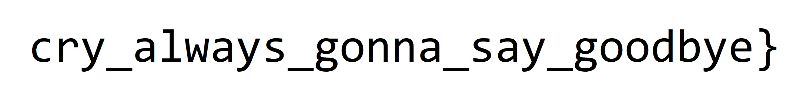

# Gocrygo

The challenges comes with a 1GB core dump and a ransomware binary that encrypts files found in the folder `gocrygo_victim_directory`. We get one such directory together with the challenge, which contains various encrypted files.

The binary is a compiled Golang program, and disassemblers had a hard time working through the binary for some reason. However, the challenge description says

> The encryption algorithm is a common cryptographic algorithm (I'm too dumb to implement one myself). In other words, please don't waste your time figuring out the details of the algorithm. Once you know which algorithm it uses, you can move on to the next phase and try to excavate the encryption key from the core.

From this point on, I figured that if I could guess the algorithm, it would be a matter of brute-forcing keys based on sections of the core file.

Running strace while encrypting a file containing all "A"s

```
read(4, "y\275\375\211\373'i\227\254\23\324\335\374]\20\37\364\255,\344\226\362\374U", 24) = 24
openat(AT_FDCWD, "/ctf/work/gocrygo_victim_directory/test.txt", O_RDONLY) = 5
fstat(5, {st_mode=S_IFREG|0777, st_size=16, ...}) = 0
read(5, "AAAAAAAAAAAAAAAA", 512)        = 16
read(5, "", 496)                        = 0
close(5)                                = 0
unlinkat(AT_FDCWD, "/ctf/work/gocrygo_victim_directory/test.txt", 0) = 0
read(4, "b\213\220.\200H\271\322", 8)   = 8
openat(AT_FDCWD, "/ctf/work/gocrygo_victim_directory/test.txt.qq", O_WRONLY|O_CREAT|O_TRUNC, 0644) = 5
write(5, "b\213\220.\200H\271\322=\337\353\312W\241\222\t\203\300.\232\263\f\320\250", 24) = 24
close(5)                                = 0
```

we see that it reads 24 bytes from urandom, then the file contents (16 bytes), andfinally another 8 bytes from urandom. It then writes 24 bytes to a file, where the first 8 bytes are equal to the 8 bytes it read from urandom. We also note that the files always increase in size by 8, and does not follow any block lengths, which reveals that we are dealing with a stream cipher or a streaming mode of a block cipher.

Assuming the first 24 bytes make up the key, we need to figure out which ciphers that use 24-byte keys and iv/nonce/counter that is 8 bytes. This could be 3DES, but also AES-192 in various modes. Testing out 3DES, with the key from the strace output, we quickly find that 3DES is at least partly correct, as one block correctly decrypts. Tweaking the modes a bit, we find that it is 3DES in CTR mode.

Now we just need to figure out the key used for the given encrypted files. Let's take a file with known plaintext and brute-force it.

```python
from Crypto.Cipher import DES3
from tqdm import tqdm
import pickle

core = open("core","rb").read()
chunks24 = set(core[i:i+24] for i in range(len(core)-24))

data = open("cute_kitten.mkv.qq","rb").read()
iv = data[:8]
enc = data[8:50]


lookfor = bytes.fromhex("1A 45 DF A3")

for chunk in tqdm(chunks24):
    try:
        dec = DES3.new(chunk, DES3.MODE_CFB, iv=iv).decrypt(enc)
        if lookfor in dec:
            print(1,chunk.hex())
    except ValueError:
        pass
...
```

I did this for all the modes, but it errored out for consecutive blocks on CTR with pycryptodome, and refused to use IVs of length 8, so the final decryption was done with CyberChef.

Key is found to be `b389ae528f9a34bd9835599b9766851b82b42580b720a318`

So now we just decrypt the flag and we're done, right?

```
Cyrillic letters are fun right?
First part: `HITCON{always_gonna_make_you_`
Hint: The second part is at `Pictures/rickroll.jpg`
 _    _.--.____.--._
( )=.-":;:;:;;':;:;:;"-._
 \\\:;:;:;:;:;;:;::;:;:;:\
  \\\:;:;:;:;:;;:;:;:;:;:;\
   \\\:;::;:;:;:;:;::;:;:;:\
    \\\:;:;:;:;:;;:;::;:;:;:\
     \\\:;::;:;:;:;:;::;:;:;:\
      \\\;;:;:_:--:_:_:--:_;:;\
       \\\_.-"             "-._\
        \\
         \\
          \\
           \\
            \\
             \\
```

Guess not. Now we need to decrypt some image as well



The final flag is

`hitcon{always_gonna_make_you_cry_always_gonna_say_goodbye}`
