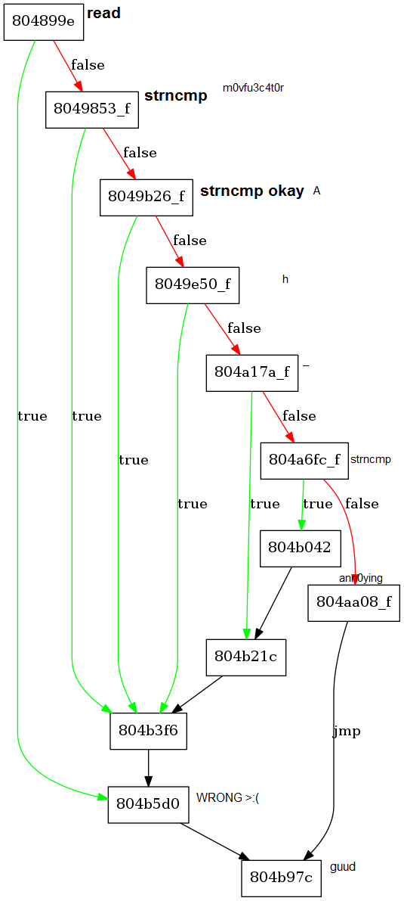
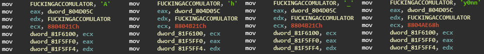

# baby C
**Category**: Reverse

74 Points

68 Solves

**Problem description**:
```
This babyc needed swaddling!

flag is ASIS{sha1(input[:14])}
```
---

OK, so right off the bat it's movfuscated.

Then I'm tried to cheese it with pintool and inscount, but it didn't work. Damn.

So instead, I used [Demovfuscator](https://github.com/kirschju/demovfuscator).
It reconstructs some jumps which helps us analyze control flow.

We get a CFG:



We can put breakpoints at those addresses to help us debug.
Also, it calls `strncmp`, so breakpointing that gives us a string `m0vfu3c4t0r!`.

We can also find that string, along with `Wrong!` and `Correct :)`, which we can xref in IDA.

At this point, I noticed some `mov`s with ASCII values, so I guessed that was comparing the first part of the string with those characters one-by-one.



Using pintool, we can also confirm that putting those characters first leads to longer execution time.

So at this point, since the problem only asks for the first part of the flag, we are pretty much done.

`ASIS{574a1ebc69c34903a4631820f292d11fcd41b906}`

But for completeness, here is the full input: `Ah_m0vfu3c4t0r!_Ann0y1ng:(`
