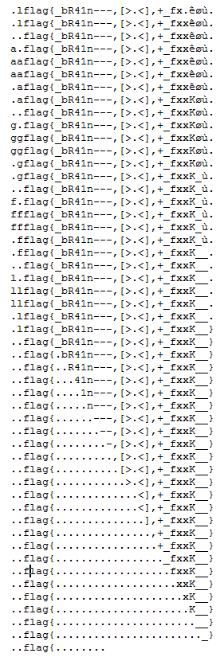

# Echo
**Category**: Reverse

80 Points

62 Solves

**Problem description**:
```
The simplest echo in the world.

Note: flag{whatyoufound}, submit ASIS{sha1(whatyoufound)}
```
---

In IDA, we can see a brainfuck interpreter and that if we pass the binary 'GIVEMEFLAG', it will load some brainfuck code to do an echo program.

Suspiciously, that brainfuck code is too long to do a simple echo program (canonically, `[,.]`).

So, we will reverse this brainfuck snippet to see what it is doing.

```
>>
[<+<+>>-]
<<
[->>+<<]
>
[>>>>>+<<<<<-]
<>>>
[<<+<+>>>-]
<<<
[->>>+<<<]
>
[>>>>>>+<<<<<<-]
<>>>>
[<<<+<+>>>>-]
<<<<
[->>>>+<<<<]
>
[>>>>>>>+<<<<<<<-]
<>>>>>
[<<<<+<+>>>>>-]
<<<<<
[->>>>>+<<<<<]
>
[>>>>>>>>+<<<<<<<<-]
<>>
[<+<+>>-]
<<
[->>+<<]
>
[>>>>>>>>>+<<<<<<<<<-]
<>>>
[<<+<+>>>-]
<<<
[->>>+<<<]
>
[>>>>>>>>>>+<<<<<<<<<<-]
<>>>>
[<<<+<+>>>>-]
<<<<
[->>>>+<<<<]
>
[>>>>>>>>>>>+<<<<<<<<<<<-]
<>>>>>
[<<<<+<+>>>>>-]
<<<<<
[->>>>>+<<<<<]
>
[>>>>>>>>>>>>+<<<<<<<<<<<<-]
<>>
[<+<+>>-]
<<
[->>+<<]
>
[>>>>>>>>>>>>>+<<<<<<<<<<<<<-]
<>>>
[<<+<+>>>-]
<<<
[->>>+<<<]
>
[>>>>>>>>>>>>>>+<<<<<<<<<<<<<<-]
<>>>>
[<<<+<+>>>>-]
<<<<
[->>>>+<<<<]
>
[>>>>>>>>>>>>>>>+<<<<<<<<<<<<<<<-]
<>>>>>
[<<<<+<+>>>>>-]
<<<<<
[->>>>>+<<<<<]
>
[>>>>>>>>>>>>>>>>+<<<<<<<<<<<<<<<<-]
<>>
[<+<+>>-]
<<
[->>+<<]
>
[>>>>>>>>>>>>>>>>>+<<<<<<<<<<<<<<<<<-]
<>>>
[<<+<+>>>-]
<<<
[->>>+<<<]
>
[>>>>>>>>>>>>>>>>>>+<<<<<<<<<<<<<<<<<<-]
<>>>>
[<<<+<+>>>>-]
<<<<
[->>>>+<<<<]
>
[>>>>>>>>>>>>>>>>>>>+<<<<<<<<<<<<<<<<<<<-]
<>>>>>
[<<<<+<+>>>>>-]
<<<<<
[->>>>>+<<<<<]
>
[>>>>>>>>>>>>>>>>>>>>+<<<<<<<<<<<<<<<<<<<<-]
<>>
[<+<+>>-]
<<
[->>+<<]
>
[>>>>>>>>>>>>>>>>>>>>>+<<<<<<<<<<<<<<<<<<<<<-]
<>>>
[<<+<+>>>-]
<<<
[->>>+<<<]
>
[>>>>>>>>>>>>>>>>>>>>>>+<<<<<<<<<<<<<<<<<<<<<<-]
<>>>>
[<<<+<+>>>>-]
<<<<
[->>>>+<<<<]
>
[>>>>>>>>>>>>>>>>>>>>>>>+<<<<<<<<<<<<<<<<<<<<<<<-]
<>>>>>
[<<<<+<+>>>>>-]
<<<<<
[->>>>>+<<<<<]
>
[>>>>>>>>>>>>>>>>>>>>>>>>+<<<<<<<<<<<<<<<<<<<<<<<<-]
<>>
[<+<+>>-]
<<
[->>+<<]
>
[>>>>>>>>>>>>>>>>>>>>>>>>>+<<<<<<<<<<<<<<<<<<<<<<<<<-]
<>>>
[<<+<+>>>-]
<<<
[->>>+<<<]
>
[>>>>>>>>>>>>>>>>>>>>>>>>>>+<<<<<<<<<<<<<<<<<<<<<<<<<<-]
<>>>>
[<<<+<+>>>>-]
<<<<
[->>>>+<<<<]
>
[>>>>>>>>>>>>>>>>>>>>>>>>>>>+<<<<<<<<<<<<<<<<<<<<<<<<<<<-]
<>>>>>
[<<<<+<+>>>>>-]
<<<<<
[->>>>>+<<<<<]
>
[>>>>>>>>>>>>>>>>>>>>>>>>>>>>+<<<<<<<<<<<<<<<<<<<<<<<<<<<<-]
<>>
[<+<+>>-]
<<
[->>+<<]
>
[>>>>>>>>>>>>>>>>>>>>>>>>>>>>>+<<<<<<<<<<<<<<<<<<<<<<<<<<<<<-]
<>>>
[<<+<+>>>-]
<<<
[->>>+<<<]
>
[>>>>>>>>>>>>>>>>>>>>>>>>>>>>>>+<<<<<<<<<<<<<<<<<<<<<<<<<<<<<<-]
<>>>>>>>
[+]
>
[+]
>
[+]
>
[+]
>
[+]
>
[+]
>
[+]
>
[+]
>
[+]
>
[+]
>
[+]
>
[+]
>
[+]
>
[+]
>
[+]
>
[+]
>
[+]
>
[+]
>
[+]
>
[+]
>
[+]
>
[+]
>
[+]
>
[+]
>
[+]
><<<<<<<<<<<<<<<<<<<<<<<<<,
[.,]

```

I don't want to read this crap, so I use some [optimizer I found online](opt.py) to generate equivalent C code:

```C
memset(mem, 0, sizeof(mem));
mem[6] = 0x15;
mem[7] = 0xF3u;
mem[8] = 1;
mem[9] = 0xEBu;
mem[10] = 0xCEu;
mem[11] = 0xC5u;
mem[12] = 0xD;
mem[13] = 0xC6u;
mem[14] = 0xC7u;
mem[15] = 0xC1u;
mem[16] = 0xCBu;
mem[17] = 0xF4u;
mem[18] = 0xD8u;
mem[19] = 0xC2u;
mem[20] = 0xDBu;
mem[21] = 0xF6u;
mem[22] = 0xC6u;
mem[23] = 0xBFu;
mem[24] = 0xFEu;
mem[25] = 0xFFu;
mem[26] = 0x12;
mem[27] = 0xC;
mem[28] = 0xEAu;
mem[29] = 0xF8u;
mem[30] = 0xF9u;
mem[31] = 0x11;
mem[2] = 'f';
mem[3] = 'l';
mem[4] = 'a';
mem[5] = 'g';
char* p = mem;

p[0] += p[2];
p[1] += p[2];
p[2] = p[0];
p[0] = 0;
p[6] += p[1];
p[1] = 0;
p[0] += p[3];
p[1] += p[3];
p[3] = p[0];
p[0] = 0;
p[7] += p[1];
p[1] = 0;
p[0] += p[4];
p[1] += p[4];
p[4] = p[0];
p[0] = 0;
p[8] += p[1];
p[1] = 0;
p[0] += p[5];
p[1] += p[5];
p[5] = p[0];
p[0] = 0;
p[9] += p[1];
p[1] = 0;
p[0] += p[2];
p[1] += p[2];
p[2] = p[0];
p[0] = 0;
p[10] += p[1];
p[1] = 0;
p[0] += p[3];
p[1] += p[3];
p[3] = p[0];
p[0] = 0;
p[11] += p[1];
p[1] = 0;
p[0] += p[4];
p[1] += p[4];
p[4] = p[0];
p[0] = 0;
p[12] += p[1];
p[1] = 0;
p[0] += p[5];
p[1] += p[5];
p[5] = p[0];
p[0] = 0;
p[13] += p[1];
p[1] = 0;
p[0] += p[2];
p[1] += p[2];
p[2] = p[0];
p[0] = 0;
p[14] += p[1];
p[1] = 0;
p[0] += p[3];
p[1] += p[3];
p[3] = p[0];
p[0] = 0;
p[15] += p[1];
p[1] = 0;
p[0] += p[4];
p[1] += p[4];
p[4] = p[0];
p[0] = 0;
p[16] += p[1];
p[1] = 0;
p[0] += p[5];
p[1] += p[5];
p[5] = p[0];
p[0] = 0;
p[17] += p[1];
p[1] = 0;
p[0] += p[2];
p[1] += p[2];
p[2] = p[0];
p[0] = 0;
p[18] += p[1];
p[1] = 0;
p[0] += p[3];
p[1] += p[3];
p[3] = p[0];
p[0] = 0;
p[19] += p[1];
p[1] = 0;
p[0] += p[4];
p[1] += p[4];
p[4] = p[0];
p[0] = 0;
p[20] += p[1];
p[1] = 0;
p[0] += p[5];
p[1] += p[5];
p[5] = p[0];
p[0] = 0;
p[21] += p[1];
p[1] = 0;
p[0] += p[2];
p[1] += p[2];
p[2] = p[0];
p[0] = 0;
p[22] += p[1];
p[1] = 0;
p[0] += p[3];
p[1] += p[3];
p[3] = p[0];
p[0] = 0;
p[23] += p[1];
p[1] = 0;
p[0] += p[4];
p[1] += p[4];
p[4] = p[0];
p[0] = 0;
p[24] += p[1];
p[1] = 0;
p[0] += p[5];
p[1] += p[5];
p[5] = p[0];
p[0] = 0;
p[25] += p[1];
p[1] = 0;
p[0] += p[2];
p[1] += p[2];
p[2] = p[0];
p[0] = 0;
p[26] += p[1];
p[1] = 0;
p[0] += p[3];
p[1] += p[3];
p[3] = p[0];
p[0] = 0;
p[27] += p[1];
p[1] = 0;
p[0] += p[4];
p[1] += p[4];
p[4] = p[0];
p[0] = 0;
p[28] += p[1];
p[1] = 0;
p[0] += p[5];
p[1] += p[5];
p[5] = p[0];
p[0] = 0;
p[29] += p[1];
p[1] = 0;
p[0] += p[2];
p[1] += p[2];
p[2] = p[0];
p[0] = 0;
p[30] += p[1];
p[1] = 0;
p[0] += p[3];
p[1] += p[3];
p[3] = p[0];
p[0] = 0;
p[31] += p[1];
p[1] = 0;
p[7] = 0;
p[8] = 0;
p[9] = 0;
p[10] = 0;
p[11] = 0;
p[12] = 0;
p[13] = 0;
p[14] = 0;
p[15] = 0;
p[16] = 0;
p[17] = 0;
p[18] = 0;
p[19] = 0;
p[20] = 0;
p[21] = 0;
p[22] = 0;
p[23] = 0;
p[24] = 0;
p[25] = 0;
p[26] = 0;
p[27] = 0;
p[28] = 0;
p[29] = 0;
p[30] = 0;
p[31] = 0;
p[7] = read();
p += 7;
while (*p != 0) {
    putchar(p[0]);
    p[0] = read();
}
```

I also copy-pasted the data initialization vector from IDA.

Now, why is it doing a bunch of operations on the memory, only to zero it?
It's probably decoding the flag then deleting it. So write out a trace of the brainfuck VMs memory as it executes, and we get a flag.


