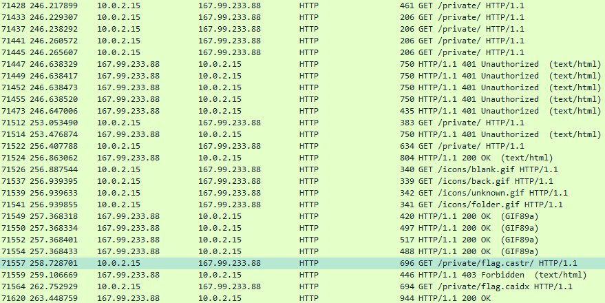

# Don't be Trashy. Try being Classy!!
**Category**: Crypto

118 Points

37 Solves

**Problem description**:
```
Don't be Trashy. Try being Classy!!
```
---

Based on the pcap, we see some HTTP traffic that looks like some Totally Legitimate Internet Research.

Towards the end, we see:


So, we can get `flag.caidx` from the pcap, which seems to be a CASync archive.
However, trying to extract it or list files leads to `Failed to run synchronizer: No such file or directory`.

In `strace`, we can see that it's trying to open a `.cacnk` file under the `default.castr` directory, so it seems like we're missing a few files.

It also seems like our internet researcher successfully guessed the HTTP Digest auth password.
Since it's digest auth, we can't get the password from the pcap but we can instead crack it.
Hashcat wasn't playing ball, so instead I hacked together a [cpu cracker](test2.py).

It turns out that the password was `rainbow`.

Now, we can't simply rip the `flag.castr` directory from the remote webserver since directory listings are off.
Instead, we can just use `strace` and grab whichever files it seems to be missing until our fileset is complete.

With that, we are done.


