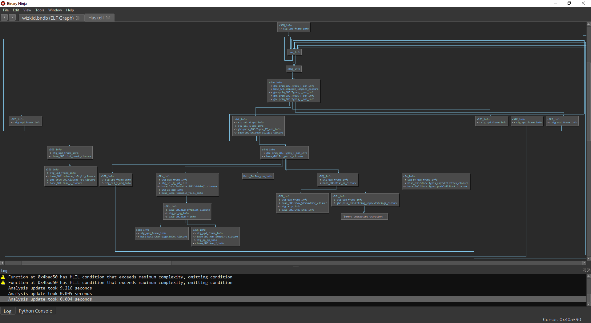

# Wizkid

**Category**: Reversing

350 Points

10 Solves

**Problem description**:

No rust or go binaries this time ;)

`nc rev.chal.csaw.io 1002`

---

Haskell binary. I read [this](https://sctf.ehsandev.com/reversing/lambda1.html) past writeup to help understand how GHC-compiled binaries work internally.

My first step was simply to fuzz the input binary with [QSYM](https://github.com/sslab-gatech/qsym), a concolic hybrid fuzzer created by one of my labmates at [SSLab](https://gts3.org/). Why fuzz? The intuition is: because GHC split up the input program into many small thunks, this is really great for coverage-based tools. If we simply ask the fuzzer to find interesting inputs that get deeper coverage into the program, then this will probably help us at least get an idea of what the program is expecting.

```
# All commands simulatenously in tmux windows
./afl/afl-fuzz -Q -i in -o out -M master -- ./wizkid
./afl/afl-fuzz -Q -i in -o out -S slave -- ./wizkid
python qsym/bin/run_qsym_afl.py -a slave -o out -n qsym ./wizkid
inotifywait -m master/queue -e create | while read path action file; do echo "New case: $file" ; cat "master/queue/$file"; ../wizkid < "master/queue/$file" 2>&1; done;
```

I ran the fuzzer on 50 cores. I watched the fuzzer steadily reach more and more coverage, progressively deeper into the program's logic! I was very surprised when within 15 minutes it had already solved the first stage of the challenge!


```
$ ./wizkid
Do you know the secret code?:
11*1*11191411111*111191*11111*111*1*11
Alright good job! now guess a number
3
wizkid: OOooooohh sooo close, you're almost there!!
CallStack (from HasCallStack):
  error, called at wizkid.hs:103:9 in main:Main
```

Looks like it is doing some kind of fancy lexing and then evaluate an arithmetic expression. At this stage, the fuzzer stopped being effective so I dropped back to static analysis.

Based on the previous write-up, I created a Binary Ninja script to better load the binary. Because of how Haskell is lazily-evaluated, all Haskell expressions actually get turned into functions. In other words, the original source code's AST effectively becomes the compiled binary's callgraph. Therefore, I wrote also wrote a quick callgraph visualizer using Binja's flowgraph API.


We can see the lexer and expression evaluator's logic loop:



So from this, we would deduce the grammar it accepts is one of simple arithmetic expressions using operators `+` and `*`.

On the other side of the program we can see the logic for stages2-4 which are pretty much all the same.


There was a Haskell decompiler by the same guy who did the earlier writeup. At this point I decided to take a look at decompilation output to see if I could make any sense of it. There were a lot of assertion errors in the Haskell decompiler, but I simply just commented out the assertions 😎 I provide my patches in the diff.

The decompilation output was pretty messed up but still intelligible. I had written a small amount of Haskell before since I used Xmonad for a long time, but my proficiency is still at the stage where I just copy-paste from StackOverflow. Nevertheless at least I grasp the syntax more or less.

The most important part to us is this code:

```haskell
(ruD_info
    s3EW_info
    (unpackCString# "Alright good job! now guess a number")
    (\ruF_info_arg_0 -> + $fNumInt ruF_info_arg_0 ruF_info_arg_0) -- THE ASNWER OF THE SECOND STAGE IS THE DOUBLE OF THE ANSWER OF THE FIRST STAGE
    ruC_info
) (>> $fMonadIO 
    (ruD_info
        s3EX_info -- STAGE1 ANSWER PLUS ONE
        (unpackCString# "ok! now guess the next number")
        (\ruG_info_arg_0 -> + $fNumInt (+ $fNumInt ruG_info_arg_0 ruG_info_arg_0) ruG_info_arg_0) -- THE ASNWER OF THE SECOND STAGE IS THE TRIPLE OF THE ANSWER OF THE FIRST STAGE, PLUS ON
        ruC_info
    ) (ruD_info 
        (ruB_info (+ $fNumInt s3EX_info loc_7325432)) -- STAGE 1 ANSWER PLUS ONE PLUS ONE
        (unpackCString# "yes! last one ??")
        (\ruH_info_arg_0 -> + $fNumInt (+ $fNumInt (+ $fNumInt ruH_info_arg_0 ruH_info_arg_0) ruH_info_arg_0) ruH_info_arg_0) -- THE ASNWER OF THE SECOND STAGE IS FOUR TIMES OF THE ANSWER OF THE FIRST STAGE, PLUS TWO
        (>>= $fMonadIO (openFile (unpackCString# "./flag.txt") ReadMode) (\s3Bn_info_arg_0 -> >>= $fMonadIO (hGetContents s3Bn_info_arg_0) (\s3Bm_info_arg_0 -> >> $fMonadIO (print ($fShow[] $fShowChar) s3Bm_info_arg_0) (hClose s3Bn_info_arg_0))))
    )
)

-- 7325432 = 0x6FC6F8 = struct { void* typeinfo = &ghc-prim_GHC.Types_I#_static_info , uint64_t val = 1 };
-- Constant immediate 1
loc_7325432 = I# 1

-- Lexer/evaluator shit
s3EW_info = (\rut_info_arg_0 ->
    case rut_info_arg_0 of
        c4fk_info_case_tag_DEFAULT_arg_0@_DEFAULT -> * $fNumInt !!ERROR!! !!ERROR!!,
        c4fk_info_case_tag_DEFAULT_arg_0@_DEFAULT -> + $fNumInt !!ERROR!! !!ERROR!!,
        c4fk_info_case_tag_DEFAULT_arg_0@_DEFAULT -> !!ERROR!!
)

-- increment by one
s3EX_info = ruB_info (+ $fNumInt s3EW_info loc_7325432)

-- stage number (False = stage1, True = stage2-4)
ruA_info = \ruA_info_arg_0 -> == ($fEq[] $fEqInt) (filter (\s3CG_info_arg_0 -> == $fEqInt (mod $fIntegralInt ruA_info_arg_0 s3CG_info_arg_0) (I# 0)) (enumFromTo $fEnumInt loc_7325448 (div $fIntegralInt ruA_info_arg_0 loc_7325448))) []

-- does nothing in stages 2-4
ruB_info = \ruB_info_arg_0 ->
    case ruA_info ruB_info_arg_0 of
        False -> ruB_info (+ $fNumInt ruB_info_arg_0 loc_7325432),
        True -> ruB_info_arg_0

ruC_info = print ($fShow[] $fShowChar) (unpackCString# "keep going!")

-- print message1, then read a number, check if input value == (ruD_info_arg_2 message1)
-- if correct, go to next_func. else, print fail message and exit
ruD_info = \input message1 ruD_info_arg_2 next_func ->
    case input of
        c49j_info_case_tag_DEFAULT_arg_0@_DEFAULT -> case ruA_info <index 0 in c49j_info_case_tag_DEFAULT> of
            False -> error (pushCallStack (Z2T (unpackCString# "error") (SrcLoc (unpackCString# "main") (unpackCString# "Main") (unpackCString# "wizkid.hs") (I# 102) loc_7325560 (I# 102) (I# 46))) emptyCallStack) (unpackCString# "Getting deeper I see :) ..."),
            True -> >> $fMonadIO
                (putStrLn message1)
                (>>= $fMonadIO
                    getLine
                    (\s3Dj_info_arg_0 ->
                        case == $fEqInt (read $fReadInt s3Dj_info_arg_0) 2 of
                            False -> error (pushCallStack (Z2T (unpackCString# "error") (SrcLoc (unpackCString# "main") (unpackCString# "Main") (unpackCString# "wizkid.hs") (I# 103) loc_7325560 (I# 103) (I# 62))) emptyCallStack) (unpackCString# "OOooooohh sooo close, you're almost there!!"),
                            True -> next_func
                    )
                )
```

The code is commented so I won't bother explaining it, but that's the gist of the last few stages. In summary:

```
-- $ nc rev.chal.csaw.io 1002
-- Do you know the secret code?:
-- 11*1*11191411111*111191*11111*111*1*11
-- Alright good job! now guess a number
-- 371403488018579819126082
-- "keep going!"
-- ok! now guess the next number
-- 557105232027869728689126
-- "keep going!"
-- yes! last one ??
-- 742806976037159638252172
-- "flag{y0u_4r3_d3f1nat3lY_a_M4tH_w1zKiD}\n"
```
