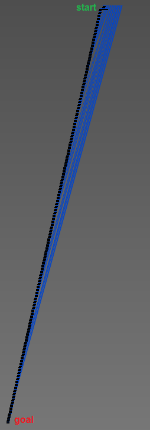
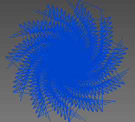

this one is truly interesting. in my opinion this is the best challenge of the whole CTF.

we seem to get a lot of functions, with a definite start(maze).

to find the goal we look at the strings near the other maze strings
'you are dead'
'you can't move that quickly'
and we find:
'you made it out alive!'
'the flag is the *shortest* path you must follow to survive'

so evidently we must solve the labyrninth.

 callgraph  polar plot

to do this we employ scripting with our Favorite Publicly-Available Open-Source Widely-Published Reverse Engineering and Disassembler tool.

<script.py>
```python
from collections import deque

class Graph(object):
    def __init__(self,f):
        self.file = f

    def node(self,name):
        self.file.write('node,%s\n' % (name))

    def edge(self,nodeFrom, nodeTo):
        self.file.write('edge,%s,%s\n' % (nodeFrom, nodeTo))

def add_vertex(g,name):
    g.node(name)
        
def add_edge(g,nodeFrom, nodeTo):
    g.edge(str(nodeFrom),str(nodeTo))

traversalDepth = 0
adrRngToNotTraverse = [] #(start,end) sections to not be traversed

def sectionsToNotTraverse(bv,sections):
    global adrRngToNotTraverse
    adrRngToNotTraverse = []
    for section in sections:
        sect = bv.sections.get(section)
        if sect:
            adrRngToNotTraverse.append((sect.start, sect.end))

def shouldNotBeTrav(bv, function):
    for start,end in adrRngToNotTraverse:
        if start <= function.start and end > function.start:
            return True
    return False

ignored = set(['__stack_chk_fail', 'getchar', 'time','puts'])

def goOn(bv,function,f):
    g = Graph(f)

    queue = deque() #(traversalLevel, function)
    queue.append((0,function,[function],''))
    visited = set()

    while queue:
        traverseLevel,func,path,directions = queue.popleft()

        if func in visited:
            continue
        if shouldNotBeTrav(bv,func):
            continue

        if func.name == 'goal':
            f.write('\n\n\nGOAL FOUND\n')
            f.write(str(traverseLevel) + '\n')
            f.write(func.name +'\n')
            f.write(repr(map(lambda fn: fn.name, path)) + '\n')
            f.write(directions + '\n')
            log.log_alert("GOAL FOUND")
            return

        visited.add(func)
        add_vertex(g,func.name)

        if traversalDepth > 0 and traverseLevel>=traversalDepth:
            continue

        for block in func.low_level_il:
            for il in block:
                if il.operation != enums.LowLevelILOperation.LLIL_CALL: #and \
                    # il.operation!=enums.LowLevelILOperation.LLIL_JUMP_TO and \
                    # il.operation!=enums.LowLevelILOperation.LLIL_JUMP:
                    continue
                callee = bv.get_functions_at(il.operands[0].value.value)[0]
                if callee.name in ignored:
                    continue

                move = '?'
                if block.immediate_dominator:
                    cf_stmt = block.immediate_dominator[-1]
                    if cf_stmt.operation == LowLevelILOperation.LLIL_IF:
                        constant = cf_stmt.operands[0].operands[1].value.value
                        move = chr(constant)
                        if move not in 'NSEW':
                            move = '?'
                    # print str(il.operands[0].value) + ' %d %s %c' % (block.immediate_dominator.start, block.immediate_dominator[-1], move)

                new_path = list(path)
                new_path.append(callee)
                queue.append((traverseLevel+1,callee,new_path,directions+move))
                add_edge(g,func.name,callee.name)

    f.write('search failed\n')
    log.log_alert("Not found")


def go(bv,function):
    global traversalDepth

    sectionsDefault = [".plt"]
    s = get_text_line_input("Enter sections to not be traversed, separated by comma.\nDefault one is '.plt'", "Sections to not traverse")
    if s:
        sections=s.split(",")
    else:
        sections=sectionsDefault

    sectionsToNotTraverse(bv,sections)

    d = get_text_line_input("Enter traversal depth, 0 for unlimited (default).", "Traversal depth")
    if not d:
        d="0"
    traversalDepth = int(d)

    with open("e:\\downloads\\out.txt", "w") as f:
        goOn(bv,function,f)

```

explanation of the script:
We start at the maze, and we BFS through the callgraph looking for goal.
the first time goal is encountered, the path taken to get there will be minimal.
so we simply implement a simple interprocedural callgraph BFS using a FIFO worklist.
we also blacklist functions in every 'maze' function (`__stack_chk_fail`, `getchar`, `time`,`puts`) for efficiency.

at this point we have a path and a list of functions but we do not know what input is necessary to traverse the maze
such that those functions are visited. to do this we look at the immediate dominators of the blocks containing
the call instructions. In graph theory a block D is a dominator of block B if all paths from the starting node to B
must pass through D. in our case the start node is the function entry block and our graph is the CFG. the immediate
dominator is just the dominator adjacent to B. then we simply parse the conditional looking for the ascii value.

we put them all together to get the flag.
`flag{SSEEEESSWWWWSSEEEEEEEESSSSEENNEESSEENNNNNNWWNNNNEESSEENNEESSEESSSSWWNNWWSSSSEESSWWSSEEEESSSSWWNNWWWWSSEESSEEEESSSSSSEESSWWSSSSEEEEEEEESSWWSSSSEEEENNNNNNNNEESSSSSSSSEENNNNNNNNEEEEEESSWWWWSSSSEESSWWSSEEEENNEESSEEEENNWWNNNNEESSEEEEEEEESSWWWWSSSSEEEESSWWWWSSEEEESSWWSSSSEEEEEESSSSSSSS}`

tl;dr static analysis is important.
