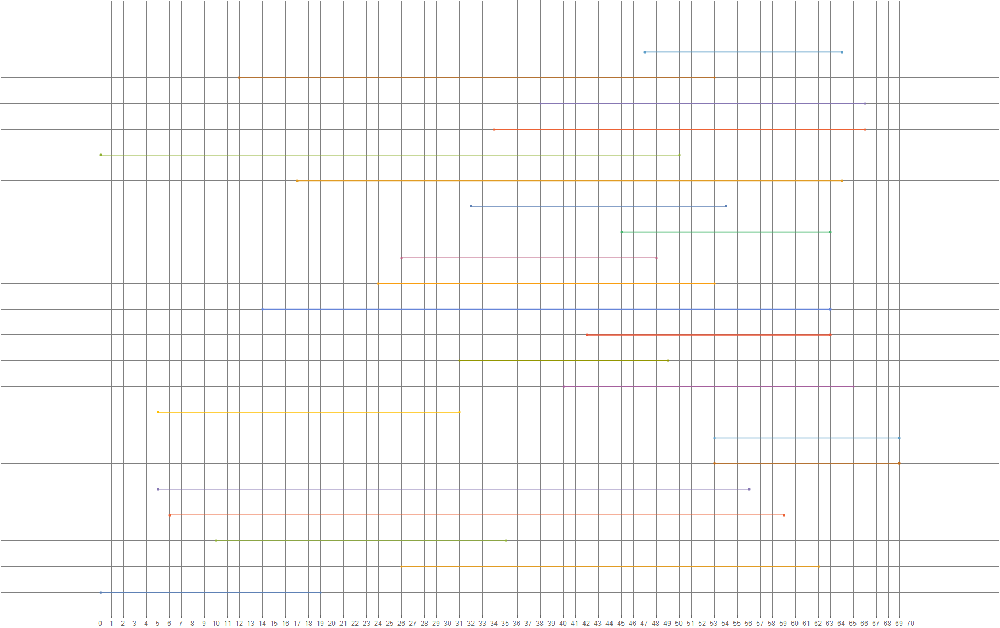

# validator

**Category**: Reverse

369 Points

8 Solves

**Problem description**:
Like any good admin, we don't store the flag, we validate that it can be generated.

**Solved by**: cts

---

*Writeup by cts*

Golang reversing! Since Golang binaries are statically compiled, that means they're all huge.

Luckily, even stripped binaries can have all function names recovered, since Golang embeds names for backtrace and reflection.
We can use [this](https://github.com/spigwitmer/golang_loader_assist) IDA script to do the job.

The unfortunate part about reversing Golang is that the calling convention pushes and returns everything on the stack.
This is bad because [IDA doesn't support stack-based return values](https://reverseengineering.stackexchange.com/questions/18305/).

However, at least we can make it have correct arguments. Generally a function prototype looks like `void __usercall func(__int64 x...)`.
We can also usually guess the number of arguments by looking at a call. For example:

```
.text:000000000048B462 0E8 mov     rcx, [rax+18h]
.text:000000000048B466 0E8 mov     rax, [rax+10h]
.text:000000000048B46A 0E8 mov     [rsp+8], rax    ; string_t
.text:000000000048B46F 0E8 mov     [rsp+10h], rcx  ; __int64
.text:000000000048B474 0E8 mov     qword ptr [rsp], 0 ; __int64
.text:000000000048B47C 0E8 call    runtime_stringtoslic
```

Arguments start at [rsp] and increase, so looks like there are 3 arguments.

Before we start, we should create some types for common Golang runtime structs:

```c
struct string_t
{
  void *pStringShit;
  char **ppData;
};
struct slice_t
{
  char *pData;
  __int64 length;
  __int64 capacity;
};
```

Anyways, we start reversing at `main__main`. 

```c
void __usercall main_main()
{
  unsigned __int64 chansSliceLen; // rax
  __int64 *channels; // rcx
  __int64 i; // rdx MAPDST
  signed __int64 iPlusOne_; // rsi
  __int64 iPlusOne; // rcx
  unsigned __int64 chansSliceLen_; // rdx
  __int64 *channels_; // rbx
  char *inputSliceData_; // rbx
  unsigned __int64 sliceLen_; // rsi
  unsigned __int64 j; // rdi
  unsigned __int64 idx; // rdx
  void *procId_; // ST00_8
  void *procId_1; // ST00_8
  string_t *procId_2; // [rsp+0h] [rbp-E8h]
  void *shaCheckResultChan; // [rsp+10h] [rbp-D8h]
  __int64 *chansSlice; // [rsp+18h] [rbp-D0h]
  unsigned __int64 chansSlice_8; // [rsp+20h] [rbp-C8h]
  __int64 chansSlice_16; // [rsp+28h] [rbp-C0h]
  __int64 inputSliceLen; // [rsp+30h] [rbp-B8h]
  unsigned __int64 chansSliceLen_1; // [rsp+48h] [rbp-A0h]
  __int64 resultOfTheThang; // [rsp+58h] [rbp-90h]
  void *resultChan; // [rsp+60h] [rbp-88h]
  char *inputSliceData; // [rsp+68h] [rbp-80h]
  __int64 shaInChan; // [rsp+70h] [rbp-78h]
  __int64 firstChan; // [rsp+78h] [rbp-70h]
  __int64 *channelsSliceData; // [rsp+80h] [rbp-68h]
  string_t sDoesNotLead; // [rsp+88h] [rbp-60h]
  string_t sDoesNotQuiteLead; // [rsp+98h] [rbp-50h]
  string_t sLeadsToFlag; // [rsp+A8h] [rbp-40h]
  string_t string; // [rsp+B8h] [rbp-30h]
  slice_t shitSentToChannel; // [rsp+C8h] [rbp-20h]

  if ( &channelsSliceData <= *(__readfsqword(0xFFFFFFF8) + 16) )
    runtime_morestack_noctxt();
  if ( numberOfArgs != 2 )
  {
    string.pStringShit = &stringShit;
    string.ppData = &pExpectingSingleArg;
    fmt_Println(&string, 1LL, 1LL);
    os_Exit(1LL);
  }
  if ( numberOfArgs <= 1 )
    runtime_panicindex();
  runtime_stringtoslicebyte(0LL, *(motherFuckingArgs + 1));
  inputSliceLen = chansSlice_8;
  inputSliceData = chansSlice;
  shaCheckResultChan = (xorChainKeyslices.length + 1);
  runtime_makeslice(asc_49B3C0, xorChainKeyslices.length + 1);
  chansSliceLen = chansSlice_8;                 // return vals...
  chansSliceLen_1 = chansSlice_8;
  channels = chansSlice;
  channelsSliceData = chansSlice;
  for ( i = 0LL; i <= xorChainKeyslices.length; i = iPlusOne_ )// initialize chans
  {
    runtime_makechan(asc_49B3C0, 1LL);
    iPlusOne = i;
    chansSliceLen_ = chansSlice_8;
    if ( i >= chansSlice_8 )
      runtime_panicindex();
    channels_ = channelsSliceData;
    if ( dword_572D30 )
      runtime_gcWriteBarrier(&channelsSliceData[i]);
    else
      channelsSliceData[i] = shaCheckResultChan;// new channel from return value. do not be fooled
    iPlusOne_ = iPlusOne + 1;
    chansSliceLen = chansSliceLen_;
    channels = channels_;
  }
  if ( !chansSliceLen )
    runtime_panicindex();
  firstChan = *channels;
  inputSliceData_ = inputSliceData;
  sliceLen_ = chansSlice_8;
  for ( j = 0LL; j < xorChainKeyslices.length; ++j )// moooore xor shit
  {
    if ( j >= sliceLen_ || j >= orderPadSlice.length )
      runtime_panicindex();
    if ( xorChainKeyslices.length == -1 )
      idx = 0LL;
    else
      idx = (orderPadSlice.pData[j] ^ inputSliceData_[j]) % xorChainKeyslices.length;
    if ( idx >= xorChainKeyslices.length )
      runtime_panicindex();
    if ( j >= chansSliceLen || j + 1 >= chansSliceLen )
      runtime_panicindex();
    LODWORD(procId_2) = 24;
    runtime_newproc(procId_2, &p_mainXorBullshit, channels[j], channels[j + 1], &xorChainKeyslices.pData[0x58 * idx]);// chans forward to next channel.
                                                // channels form a chain of channels
    chansSliceLen = chansSliceLen_1;
    channels = channelsSliceData;
    inputSliceData_ = inputSliceData;
    sliceLen_ = inputSliceLen;
  }
  shaInChan = channels[chansSliceLen - 1];
  runtime_makechan(asc_49B440, 1LL);
  resultChan = shaCheckResultChan;              // return val
  LODWORD(procId_) = 16;
  runtime_newproc(procId_, &pMainSha512Shit, shaInChan, shaCheckResultChan);
  LODWORD(procId_1) = 8;
  runtime_newproc(procId_1, &pmain_sendThreeAfterOneSecond, resultChan);
  shitSentToChannel.pData = inputSliceData;
  shitSentToChannel.length = inputSliceLen;
  shitSentToChannel.capacity = chansSlice_16;
  runtime_chansend1(firstChan, &shitSentToChannel);
  resultOfTheThang = 0LL;
  runtime_chanrecv1(resultChan, &resultOfTheThang);
  if ( resultOfTheThang == 1 )
  {
    sLeadsToFlag.pStringShit = &stringShit;
    sLeadsToFlag.ppData = &pLeadsToFlag;
    fmt_Println(&sLeadsToFlag, 1LL, 1LL);
  }
  else if ( resultOfTheThang == 2 )
  {
    sDoesNotQuiteLead.pStringShit = &stringShit;
    sDoesNotQuiteLead.ppData = &pDoesNotQuiteLeadToTheFlag;
    fmt_Println(&sDoesNotQuiteLead, 1LL, 1LL);
  }
  else                                          // == 3, from the goroutine that sleeps 1 second
  {
    sDoesNotLead.pStringShit = &stringShit;
    sDoesNotLead.ppData = &pDoesNotLeadToFlag;
    fmt_Println(&sDoesNotLead, 1LL, 1LL);
  }
}
```

Since nobody is actually going to read that, here is a rough summary.

```go
import "os"
func main() {
  if len(os.Args) < 2 {
    fmt.Println("Expecting single argument: flag precursor value")
    os.Exit()
  }
  input := []byte(os.Args[1])
  chans := make([]chan []byte, len(xorChainKeyslices) + 1)
  for i := range chans {
    chans[i] = make(chan []byte)
  }
  for i := range xorChainKeyslices {
    idx := (orderPadSlice[i] ^ input[i]) % len(xorChainKeyslices)
    go xorBullshit(chans[i], chans[i+1], xorChainKeyslices[i])
  }
  results := make(chan int)
  go sha512Shit(chans[len(chans) - 1], results)
  go timeoutFail(results)
  chans[0] <- input
  result :=<- results
  if result == 1 {
    fmt.Println("this leads to the flag")
  } else if result == 2{
    fmt.Println("his does not quite lead to the flag\ntry harder")
  } else {
    fmt.Println("this does not lead to the flag")
  }
}
```

There's some static slices, here they are:

```c
struct __attribute__((aligned(8))) XorShit_t
{
  _QWORD offset1;
  slice_t data1;
  slice_t correctData;
  _QWORD offset2;
  slice_t data2;
};

// orderPadSlice = { 83 23 42 69 23 B2 0E 28 97 DF 14 }

// xorChainKeyslices = 
// XorShit_t <  0, <offset unk_5426E0, 13h, 13h>, <offset unk_5426C0, 13h, 13h>, 1Ah, <offset unk_542F00, 24h, 24h>>
// XorShit_t <0Ah, <offset unk_542CC0, 19h, 19h>, <offset unk_542CE0, 19h, 19h>,   6, <offset unk_543B00, 35h, 35h>>
// XorShit_t <  5, <offset unk_543A80, 33h, 33h>, <offset unk_543AC0, 33h, 33h>, 35h, <offset unk_5424A0, 10h, 10h>>
// XorShit_t <35h, <offset unk_5424B0, 10h, 10h>, <offset unk_5424C0, 10h, 10h>,   5, <offset unk_542D40, 1Ah, 1Ah>>
// XorShit_t <28h, <offset unk_542D00, 19h, 19h>, <offset unk_542D20, 19h, 19h>, 1Fh, <offset unk_542500, 12h, 12h>>
// XorShit_t <2Ah, <offset unk_542720, 15h, 15h>, <offset unk_542740, 15h, 15h>, 0Eh, <offset unk_543A00, 31h, 31h>>
// XorShit_t <18h, <offset unk_542D80, 1Dh, 1Dh>, <offset unk_542DA0, 1Dh, 1Dh>, 1Ah, <offset unk_542760, 16h, 16h>>
// XorShit_t <2Dh, <offset unk_542520, 12h, 12h>, <offset unk_542540, 12h, 12h>, 20h, <offset unk_542780, 16h, 16h>>
// XorShit_t <11h, <offset unk_543780, 2Fh, 2Fh>, <offset unk_5437C0, 2Fh, 2Fh>,   0, <offset unk_543A40, 32h, 32h>>
// XorShit_t <22h, <offset unk_542EA0, 20h, 20h>, <offset unk_542EC0, 20h, 20h>, 26h, <offset unk_542D60, 1Ch, 1Ch>>
// XorShit_t <0Ch, <offset unk_5434C0, 29h, 29h>, <offset unk_543500, 29h, 29h>, 2Fh, <offset unk_5424E0, 11h, 11h>>

```

There's three goroutines that we need to reverse too.

```c
void __fastcall main_timeoutFail(__int64 a1, __int64 a2, __int64 a3, __int64 a4, __int64 a5, __int64 a6, __int64 chan)
{
  void *retaddr; // [rsp+18h] [rbp+0h]

  if ( &retaddr <= *(__readfsqword(0xFFFFFFF8) + 16) )
    runtime_morestack_noctxt();
  time_Sleep(1000000000LL);                     // 1 second
  runtime_chansend1(chan, &three);
}
```

This basically creates a race between the results from the `xorBullshit` chain and this timeout.
If `xorBullshit` chain never completes, the timeout happens after 1 second and we get a nice ugly fail message.

```c
void __usercall main_sha512Shit(__int64 inChan, __int64 outChan)
{
  slice_t v2; // ST00_24
  __int128 sha512Result; // [rsp+18h] [rbp-E0h]
  __int128 sha512Result_16; // [rsp+28h] [rbp-D0h]
  __int128 sha512Result_32; // [rsp+38h] [rbp-C0h]
  __int128 sha512Result_48; // [rsp+48h] [rbp-B0h]
  char buffer1[64]; // [rsp+58h] [rbp-A0h]
  char buffer2[64]; // [rsp+98h] [rbp-60h]
  slice_t hashedBuf; // [rsp+D8h] [rbp-20h]

  if ( &buffer1[40] <= *(__readfsqword(0xFFFFFFF8) + 16) )
    runtime_morestack_noctxt();
  hashedBuf.pData = 0LL;
  *&hashedBuf.length = 0LL;
  runtime_chanrecv1(inChan, &hashedBuf);
  *&v2.pData = *&hashedBuf.pData;
  v2.capacity = hashedBuf.capacity;
  crypto_sha512_Sum512(v2);
  *buffer1 = sha512Result;
  *&buffer1[16] = sha512Result_16;
  *&buffer1[32] = sha512Result_32;
  *&buffer1[48] = sha512Result_48;
  *buffer2 = *byte_4D03A0;
  *&buffer2[16] = *&byte_4D03A0[16];
  *&buffer2[32] = *&byte_4D03A0[32];
  *&buffer2[48] = *&byte_4D03A0[48];
  bytes_Equal(buffer1, 64LL, 64LL, buffer2, 64LL, 64LL);
  if ( BYTE8(sha512Result_16) )
    runtime_chansend1(outChan, &one);
  else
    runtime_chansend1(outChan, &two);
}
```

Not rocket science, just does a sha512sum and compares it against a hash, `26B7F8B7DD2E2EBFD41785C6E0B0329DD539933C3540FBB0F63271C2EA6AE1A0E1668C5746182FBE03065109FFC762DDE896B14A1AC6D1B19D60F971F19198D6`.
The hash isn't crackable obviously, it's probably the flag.


```c
void __usercall main_xorBullshit(void *inChan, __int64 outChan, XorShit_t *xorShit)
{
  __int64 dataReceived_len; // rax
  char *dataReceived_pData; // rcx
  __int64 dataReceived_cap; // rdx
  __int64 i; // rsi
  __int64 idx0; // r8
  __int64 j; // rsi
  __int64 idx; // r8
  slice_t dataReceived; // [rsp+10h] [rbp-38h]
  slice_t dataToSend; // [rsp+28h] [rbp-20h]
  void *retaddr; // [rsp+48h] [rbp+0h]

  if ( &retaddr <= *(__readfsqword(0xFFFFFFF8) + 16) )
    runtime_morestack_noctxt();
  dataReceived.pData = 0LL;
  *&dataReceived.length = 0LL;
  runtime_chanrecv1(inChan, &dataReceived);
  dataReceived_len = dataReceived.length;
  dataReceived_pData = dataReceived.pData;
  dataReceived_cap = dataReceived.capacity;
  for ( i = 0LL; i < xorShit->data1.length; ++i )// xor bullshit
  {
    idx0 = i + xorShit->offset1;
    if ( idx0 >= dataReceived.length )
      return;
    if ( idx0 >= dataReceived.length || i >= xorShit->correctData.length )
      runtime_panicindex();
    if ( (dataReceived.pData[idx0] ^ xorShit->data1.pData[i]) != xorShit->correctData.pData[i] )
      return;
  }
  for ( j = 0LL; j < xorShit->data2.length; ++j )// xor bullshit
  {
    idx = j + xorShit->offset2;
    if ( idx >= dataReceived_len )
      return;
    if ( idx >= dataReceived_len )
      runtime_panicindex();
    dataReceived_pData[idx] ^= xorShit->data2.pData[j];
  }
  dataToSend.pData = dataReceived_pData;        // dataToSend = dataToReceive
  dataToSend.length = dataReceived_len;
  dataToSend.capacity = dataReceived_cap;
  runtime_chansend1(outChan, &dataToSend);
}
```

I won't translate that, it's pretty obvious. At each step, it first checks some region of the input for correct values. Then, it xors some other region of the input with a different key. I created a diagram of what the regions looked like:



Anyways the gist of the challenge is we need to undo the `xorShit` chain.
To do that we need to guess the order they're called in, which is generated from the user input.
After we have the order, it's really trivial to recover the flag by unwinding the xor chain for each byte of the output.

We have two approaches:
 - be smart about it, only try combinations that pass the chain's conditions
 - brute force it, it's only 11! permutations

For the first one, I also made a hunch that we can't repeat any of the xor chain elements.
This is not strictly required by the program but it turned out to be true. That reduces the search space a lot.

```python
binary=map(ord, open('validator','rb').read())
delta=0x5426E0-0x1426E0 # virtual - real = delta => real = virtual - delta
meme="""
0 5426E0 13 13 5426C0 13 13 1A 542F00 24 24
0A 542CC0 19 19 542CE0 19 19 6 543B00 35 35
5 543A80 33 33 543AC0 33 33 35 5424A0 10 10
35 5424B0 10 10 5424C0 10 10 5 542D40 1A 1A
28 542D00 19 19 542D20 19 19 1F 542500 12 12
2A 542720 15 15 542740 15 15 0E 543A00 31 31
18 542D80 1D 1D 542DA0 1D 1D 1A 542760 16 16
2D 542520 12 12 542540 12 12 20 542780 16 16
11 543780 2F 2F 5437C0 2F 2F 0 543A40 32 32
22 542EA0 20 20 542EC0 20 20 26 542D60 1C 1C
0C 5434C0 29 29 543500 29 29 2F 5424E0 11 11
"""

from operator import xor
def to_hex(a):
    return ''.join(map(lambda q: hex(q)[2:4] if q >= 0 else '00',a))

class Interval(object):
    def __init__(self,a,b,pdata):
        self.a = a
        self.b = b
        self.pdata = pdata

        if pdata:
            self.buf = [0]*70
            pdata = self.pdata-delta
            self.buf[self.a:self.b] = binary[pdata:pdata+len(self)]

    def __contains__(self, x):
        return self.a <= x <= self.b

    def __len__(self):
        return self.b-self.a

    def __and__(self, other):
        a = max(self.a, other.a)
        b = min(self.b, other.b)
        if a >= b:
            return None
        return Interval(a,b,None)

    def __xor__(self, other):
        return map(xor, self.buf, other.buf)

    def __str__(self):
        return '[%d, %d]' % (self.a, self.b)

zemes = []
for shit in meme.split('\n'):
    if not shit: continue
    shit = shit.split(' ')
    shit = map(lambda fuck: int(fuck, 16), shit)
    offset1,pdata1,len1,cap1,pdata_correct,len_correct,cap_correct,offset2,pdata2,len2,cap2 = shit
    assert (len_correct == len1)
    known = Interval(offset1, offset1+len1, pdata1)
    check = Interval(offset1, offset1+len1, pdata_correct)
    correct = known ^ check
    xored = Interval(offset2, offset2+len2, pdata2)
    zemes.append((known,correct,xored))


order_pad = [0x83,0x23,0x42,0x69,0x23,0xB2,0x0E,0x28,0x97,0xDF,0x14,]

from itertools import chain, combinations
def powerset(iterable):
    s = list(iterable)
    return chain.from_iterable(combinations(s, r) for r in range(len(s)+1))

print 'PHASE1 START'
cands=[]
for q in range(0,11):
    zoom=0
    pads = []
    for x in range(0,len(zemes)):
    # for x in order:
        known, correct, xored = zemes[x]
        if q in known:
            know = correct[q]
            if not zoom:
                zoom = know
            else:
                assert zoom == know
            print 'know',hex(x),hex(know),'at',q
        if q in xored:
            pad = xored.buf[q]
            pads.append(pad)
            print 'pad ',hex(x),hex(pad)
    print set(map(lambda padd: zoom^padd,map(lambda padds: reduce(xor,padds,0),powerset(pads))))
    cands.append(set(map(lambda padd: zoom^padd,map(lambda padds: reduce(xor,padds,0),powerset(pads)))))
    print

print 'PHASE2 START'
import itertools
valid=[]
i = 0
for start in itertools.product(*cands):
    if i % 100000 == 0:
        print i,
    i+=1
    order= map(__import__('operator').mod, map(xor,start,order_pad), [11]*11)
    if len(set(order))!=len(order):
        continue
    output=[]
    # check consistency
    for q in range(0,11):
        zoom = start[q]
        for x in order:
            known, correct, xored = zemes[x]
            if q in known:
                know = correct[q]
                if zoom != know:
                    break
            if q in xored:
                pad = xored.buf[q]
                zoom ^= pad
        else:
            if q < 5:
                if q == 0 and zoom != ord('D'):
                    break
                if q == 1 and zoom != ord('C'):
                    break
                if q == 2 and zoom != ord('T'):
                    break
                if q == 3 and zoom != ord('F'):
                    break
                if q == 4 and zoom != ord('{'):
                    break
            if zoom < 32 or zoom > 0x7f:
                break
            output.append(zoom)
            continue
        break
    else:
        print
        print start
        valid.append(start)
print
print len(valid),'valid'

print 'PHASE3 START'
for cand in valid:
    order= map(__import__('operator').mod, map(xor, cand, order_pad), [11]*11)
    solution=[]
    # print order
    for q in range(0,70):
        zoom=0
        for z,x in enumerate(reversed(order)):
            known, correct, xored = zemes[x]
            if q in xored:
                pad = xored.buf[q]
                zoom ^= pad
            if q in known:
                know = correct[q]
                zoom ^= know
                if know != 0:
                    break
        if zoom != 0 and (zoom < 32 or zoom > 0x7f):
            break
        solution.append(zoom)
    else:
        print ''.join(map(chr,solution))
        print cand
```

```
PHASE1 START
know 0x0 0x83 at 0
pad  0x8 0xc7
set([131, 68])

know 0x0 0x21 at 1
pad  0x8 0x62
set([33, 67])

know 0x0 0x43 at 2
pad  0x8 0x17
set([67, 84])

know 0x0 0x63 at 3
pad  0x8 0x25
set([99, 70])

know 0x0 0x25 at 4
pad  0x8 0x5e
set([123, 37])

know 0x0 0xb1 at 5
know 0x2 0xb1 at 5
pad  0x3 0x23
pad  0x8 0xa3
set([177, 146, 18, 49])

know 0x0 0x6 at 6
pad  0x1 0x46
know 0x2 0x6 at 6
pad  0x3 0x99
pad  0x8 0xec
set([64, 6, 234, 172, 115, 53, 217, 159])

know 0x0 0x2c at 7
pad  0x1 0xd0
know 0x2 0x2c at 7
pad  0x3 0xca
pad  0x8 0x2
set([228, 230, 44, 46, 52, 54, 252, 254])

know 0x0 0x90 at 8
pad  0x1 0xba
know 0x2 0x90 at 8
pad  0x3 0x61
pad  0x8 0x7e
set([42, 75, 238, 143, 144, 241, 84, 53])

know 0x0 0xda at 9
pad  0x1 0x9f
know 0x2 0xda at 9
pad  0x3 0xa
pad  0x8 0x2b
set([100, 69, 110, 79, 208, 241, 218, 251])

know 0x0 0x1d at 10
know 0x1 0x1d at 10
pad  0x1 0x2f
know 0x2 0x1d at 10
pad  0x3 0x70
pad  0x8 0x20
set([66, 98, 109, 50, 77, 29, 18, 61])

PHASE2 START
0 100000
(131, 33, 67, 99, 37, 177, 6, 44, 144, 218, 29)
200000 300000 400000 500000 600000 700000 800000 900000 1000000 1100000 1200000 1300000 1400000 1500000 1600000 1700000 1800000 1900000 2000000 2100000 2200000 2300000 2400000 2500000 2600000 2700000 2800000 2900000 3000000 3100000 3200000 3300000 3400000 3500000 3600000 3700000 3800000 3900000 4000000 4100000
1 valid
PHASE3 START
DCTF{1545dbabe88f4e3fcb321e9bffe622e6fa56b5a44c3f165dc607fb87274ea514
```

The way it works is that for each of the first 11 bytes, we don't know what order the xors (pads) and checks (knowns) are for that byte, so we try all combinations of them. Then, we filter those in stage 2 for candidates that are consistent. Lastly in stage 3 we use the filtered candidate inputs from stage 2 to generate the flag.

The brute forcer, on the other hand, is quite slow but much simpler:

```python
order_pad = [0x83,0x23,0x42,0x69,0x23,0xB2,0x0E,0x28,0x97,0xDF,0x14,]

import itertools
i = 0
for order in itertools.permutations(range(0,11)):
    i += 1
    if i % 10000 == 0:
        sys.stderr.write(str(i) + ' ')
    solution = []
    output = []
    for q in range(0,70):
        zoom = 0
        for x in order:
            known, correct, xored = zemes[x]
            if q in known:
                zoom ^= correct[q]
                if correct[q] != 0:
                    break
            if q in xored:
                zoom ^= xored.buf[q]
        solution.append(zoom)
        if q < 11:
            if (zoom^order_pad[q])%11 != order[q]:
                break

        zoom = solution[q]
        for x in order:
            known, correct, xored = zemes[x]
            if q in known:
                if correct[q] != 0 and correct[q] != zoom:
                    break
            if q in xored:
                zoom ^= xored.buf[q]
        else:
            if q < 5 and zoom != ord('DCTF{'[q]):
                break
            if zoom != 0 and (zoom < 32 or zoom > 0x7f):
                break
            output.append(zoom)
            continue
        break
    else:
        print solution
        print ''.join(map(chr,output))
        # print to_hex(output)
```

Finally, the xor network looks like this:

```
[0, 2, 1, 10, 6, 3, 8, 4, 7, 5, 9]
8321436325b1062c90da1db8f11bd94d3b089241dbef5bc35954202ef1d9f951dcd6a9787ead087c7fa6b120bb99b59f3dd685d1cfe3adcfab35df6d4587ea786eb1ef5cdb00
8321436325b1062c90da1db8f11bd94d3b0892000000000000000000000000000000000000000000000000000000000000000000000000000000000000000000000000000000
00000000000000000000000000000000000000000000000000006d955bc81686c8ed201d0767c68627f2e4fa3dea42583f6f45d451c580da6b38f6cc8d120000000000000000
0000000000b1062c90da1db8f11bd94d3b089241dbef5bc359544dbbaa11efd7143b896579cacefa585455da8673f7c702b9c0059e262d150000000000000000000000000000
0000000000000000000000000000000000000000000000000000000000000000000000000000000000000000000000000000000000521ae780305adaa32d47c3029cda6def00
000000000000000000001db8f11bd94d3b089241dbef5bc359544dbbaa11efd7143b890000000000000000000000000000000000000000000000000000000000000000000000
00000000000046d0ba9f2f3a311f9bba0b03fb8cfa15294ff4bb1e62a68bd1ebbb6ef390a10918ba7d81e4ae745327acde37b26fc3d1d2034fe7440000000000000000000000
000000000000000000000000c00442f7300b69cd21fa728cadef53d90c9a3e3caf557af5d8c3d64025d5b174f220d06bdc8e726a5d0000000000000000000000000000000000
00000000000000000000000000000000000000000000000000000000000000000000000000000000000000000000002f49e082094d4c37ba9c7da5d9f03e2fb4000000000000
000000000000000000000000000000000000000000000000adef53d90c9a3e3caf557af5d8c3d64025d5b174f220d044956ef063100000000000000000000000000000000000
000000000000000000000000000000000000000000000000000067ef79da9281a66d2c8a84dfe60fae4d9e1151d2662100000000000000000000000000000000000000000000
0000000000000000000000000000000000000000000000000000000000000000000000000000000000000000000000000000000000e9d24b93a792a29b86820f6c2d35313400
00000000002399ca610a706ee1ec7166774a4f6f4a12636c71dc5d6667b58e000000000000000000000000000000000000000000000000000000000000000000000000000000
00000000000000000000000000000000004126a26be811e0dc33695012f522bd0938567f5c1c304f8b982f65a3f2b665956ef06310e9d24b93a792a29b86820f000000000000
c76217255ea3ec027e2b208d438d284be50fa38e0c48f0c0fe2b961f9a4539c4348c659210cf04aa9f6461c8292d537a5bf20000000000000000000000000000000000000000
0000000000000000000000000000000000000000000000000000000000000000000000000000000014fc4ead8adfe51fce9cf06310e9d24b93a792a29b86820f6c0000000000
000000000000000000000000000000000000000000000000000000000000001fb4383ac04216fd5b139f825200bd16761b000000000000000000000000000000000000000000
00000000000000000000000000000000000000000000000000000000000000000000000000000000000000000062f369d59cf06310e9d24b93a792a29b868200000000000000
000000000000000000000000000000000000000000000000000000000000000062d5c448202c0a9940cf0b644b9888d28f51dbe99cc000000000000000000000000000000000
000000000000000000000000000000000000000000000000000000000000000000000000000000000000c79bc1fa7bbb5acd2b8a8c29d24b93a792a29b868200000000000000
000000000000000000000000000023e2c47ae01f01c3831310299a76ead67d03dd6bff00188fec87de5e98a07f4da6ba647d5f2a6afcd7274a8761450b9daf00000000000000
00000000000000000000000000000000000000000000000000000000000000000000326536662fa099f25f3bbeb7dd013eb074a0e6d5056cd920f3e7901b2d0f6c2d00000000
00000000000000000000000000000000000000000000000000000000000000000000000000004e95af906a5a8a83be325881429582b6335cee4691dfa7291a3b094c00000000
444354467b3135343564626162653838663465336663623332316539626666653632326536666135366235613434633366313635646336303766623837323734656135313400
444354467b3135343564626162653838663465336663623332316539626666653632326536666135366235613434633366313635646336303766623837323734656135313400
DCTF{1545dbabe88f4e3fcb321e9bffe622e6fa56b5a44c3f165dc607fb87274ea514
```

We're missing a final `}`, but when you pass the input into the program, it's happy with it.

```
# root@ubuntu:~# ./validator "`python solver.py`"
# this leads to the flag!
```
