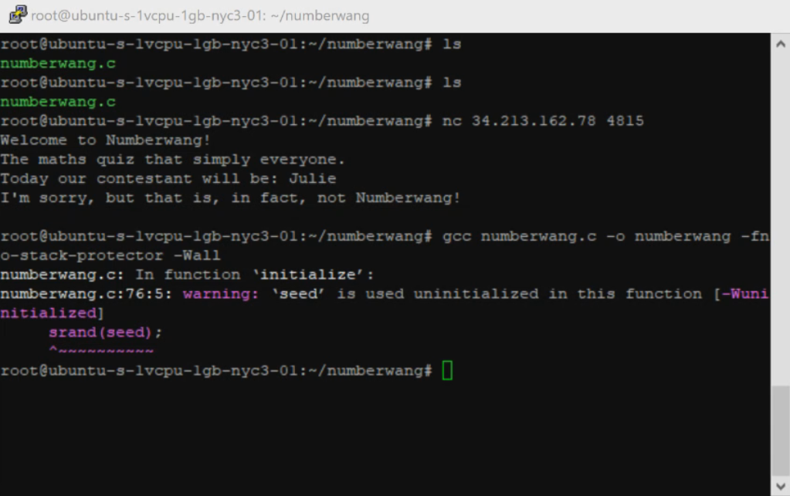
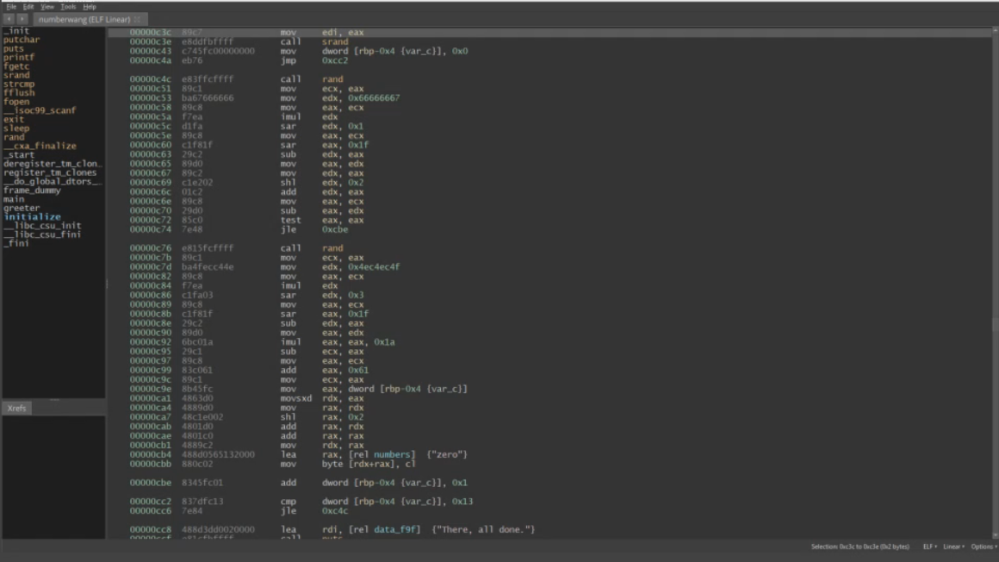

# Important Videos

**Category:** Misc

200 Points

10 Solves

We are given a video, no binary or source code. It's a screencast, and we can spot:

Source code snippet


GCC command line used to compile



Disassembly snippet



So our goal for this challenge is really to predict rand(). The `-fno-stack-protector` flag and uninitialized variable warning on the GCC image really gives away that we will need to overflow the name buffer into a stack variable `seed` in `initialize()`. So, we are able to easily control the seed as long as we enter a long enough name. We know `scanf(%79s)` is probably used since we know the program has different behavior on inputting `Simon` or `Julie` as your name as opposed to `Simon asdf` and `Julie asdf` so our name should not have spaces.

However, it's not so simple as that, because the numbers array is modified randomly, as seen in the disassembly. Really the bulk of the assembly are two integer modulus by multiplication, so it can be decompiled pretty straightforward.

```C
void initialize() {
    int seed;
    srand(seed);    
    for (int counter = 0; counter < 20; counter++) {
        if(rand() % 5 <= 0) {
            continue;
        } else {
            numbers[counter][0] = 'a' + rand() % 26;
        }
    }
}
```

We can also guess that the `numbers` array is a 2D char array of 10-length zero-terminated strings based on the assembly: `char numbers[20][10]`. So then our job is basically done.

```
$ gcc --std=c11 fuck.c -fno-stack-protector -Wall

$ ./a.out | nc 34.213.162.78 4815
Welcome to Numberwang!
The maths quiz that simply everyone.
Today our contestant will be: I'm sure that's not right, but welcome to the show, SomebodyOnceToldMeTheWorldWasGonnaRollMeIAin'tTheSharpestToolInTheShed..haha!
Hang on for a moment, while I fetch the Numberwang rulebook...
There, all done.
Alright. Today, we'll be playing Imaginary Numbers.
Let's begin!
> > > > > > > > > > And that's Wangernumb!
Thanks for playing, and see you tomorrow for less Numberwang!
flag{w3_0n1y_g0t_5h1NTy_6_d@y5_+0_5@v3_tH3_w0R1D}
```

Get it? Since we're playing "Imaginary Numbers," all of the numbers are made up. They're *imaginary*.
