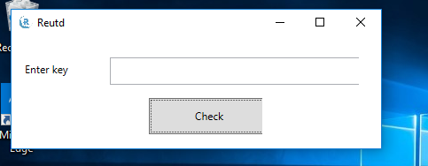

# RE06

So we are provided with a reverse.exe binary. Running `strings` on it, we see that it's a .NET binary.

Running it in our windows VM, we're presented with a screen which asks for our "key".



Since it's .NET, we can easily decompile it to the source (pretty accurately).

Popping in dnSpy, we easily recognize all the interesting stuff. There is a `btn_check_Click` function.

```
// WpfApp1.MainWindow
// Token: 0x06000007 RID: 7 RVA: 0x000021C4 File Offset: 0x000003C4
private void btn_check_Click(object sender, RoutedEventArgs e)
{
	string text = this.tb_key.Text;
	string a = MainWindow.Enc(text, 9157, 41117);
	bool flag = a == "iB6WcuCG3nq+fZkoGgneegMtA5SRRL9yH0vUeN56FgbikZFE1HhTM9R4tZPghhYGFgbUeHB4tEKRRNR4Ymu0OwljQwmRRNR4jWBweOKRRyCRRAljLGQ=";
	if (flag)
	{
		MessageBox.Show("Correct!! You found FLAG");
	}
	else
	{
		MessageBox.Show("Try again!");
	}
}
```

So it basically takes the "key" we enter and passes it to the Enc() function and them compared the result with a hardcoded string, your typical rev.

Let's take a look at the `Enc()` function

```
// WpfApp1.MainWindow
// Token: 0x06000005 RID: 5 RVA: 0x000020A4 File Offset: 0x000002A4
public static string Enc(string s, int e, int n)
{
	int[] array = new int[s.Length];
	for (int i = 0; i < s.Length; i++)
	{
		array[i] = (int)s[i];
	}
	int[] array2 = new int[array.Length];
	for (int i = 0; i < array.Length; i++)
	{
		array2[i] = MainWindow.mod(array[i], e, n);
	}
	string text = "";
	for (int i = 0; i < array.Length; i++)
	{
		text += (char)array2[i];
	}
	return Convert.ToBase64String(Encoding.Unicode.GetBytes(text));
```

Wow this is typical, it encrypts each char of our "key" one by one and then base64 encodes the final string. It uses a `mod()` function to encrypt each character.

```
// WpfApp1.MainWindow
// Token: 0x06000006 RID: 6 RVA: 0x00002150 File Offset: 0x00000350
public static int mod(int m, int e, int n)
{
	int[] array = new int[100];
	int num = 0;
	do
	{
		array[num] = e % 2;
		num++;
		e /= 2;
	}
	while (e != 0);
	int num2 = 1;
	for (int i = num - 1; i >= 0; i--)
	{
		num2 = num2 * num2 % n;
		bool flag = array[i] == 1;
		if (flag)
		{
			num2 = num2 * m % n;
		}
	}
	return num2;
}
```

This is easy, we can just bruteforce each char and select the one which matches the byte of the flag. I re-wrote everything in Python because I hate .NET and the flag easy to recover

```

def mod(m,e,n):
	myarrray = []
	nm = 0
	while e != 0:
		myarrray.append(e%2)
		nm += 1
		e /= 2
	nm2 = 1

	for k in reversed(range(0,nm)):
		nm2 = (nm2 * nm2) % n
		if myarrray[k] == 1:
		 	nm2 = (nm2 * m) %n

	return nm2

def enc(strn, e, n):
	return "".join([unichr(mod(ord(X), e,n)) for X in strn])


flag = "iB6WcuCG3nq+fZkoGgneegMtA5SRRL9yH0vUeN56FgbikZFE1HhTM9R4tZPghhYGFgbUeHB4tEKRRNR4Ymu0OwljQwmRRNR4jWBweOKRRyCRRAljLGQ=".decode('base64')
#WhiteHat{N3xT_t1m3_I_wi11_Us3_l4rg3_nUmb3r}
mainFlag = ""

while enc(mainFlag,9157,41117).encode('utf-16-le') != flag:
	for m in range(127):
		cur = enc(mainFlag+chr(m),9157,41117).encode('utf-16-le')
		if flag.startswith(cur):
			mainFlag += chr(m)
			print mainFlag
			break
```