# rev04

**Category**: Reverse

390 Points

11 Solves

**Problem description**:
n/a

**Solved by**: cts, sampriti

---

*Writeup by cts*

This challenge was a very tough multistaged Windows rev. The only thing missing was a remote code stub dongle ;)

The only file we are given is `WH2018.exe`. The first thing to notice is that Windows refuses to even load it, indicating the PE header is damaged. 

## Phase 1: Unpacking


Let's try to load it in IDA anyways.

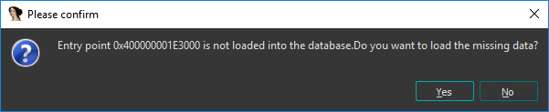

Ok...maybe not such a great idea. We better put it under [CFF Explorer][1] instead.


Everything seems normal up to this point...DOS and PE header are OK too.

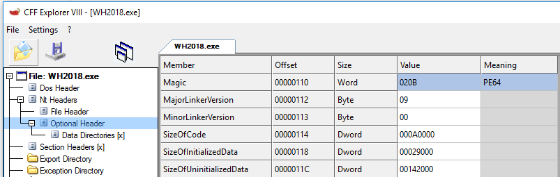

Hold it! If this is a 32-bit code binary, then why is it a PE64 file? It's rare for 32-bit binaries to be compiled into PE64+ (64-bit) binaries. If you disassemble some of the code too, it's clearly 32-bit. So let's fix that:


Also, fixing that makes the program's icon show up, which means we're on the right track! That means the resources directory got parsed correctly.


Moving on, the rest of this Optional Header seems really messed up as well, namely the Entrypoint:


To recover OEP, we need to unfortunately take a look at the actual binary's contents.

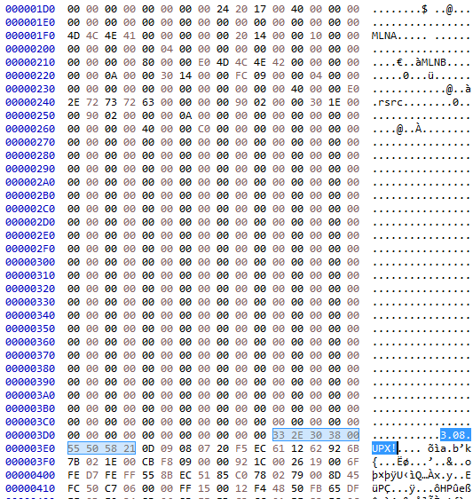

Judging from this, it's pretty obviously packed with UPX 3.08, but the UPX0 and UPX1 sections have been renamed to break the unpacker in case we try to decompress it as-is:

```
> upx394w\upx.exe -d "WH2018.exe"
                       Ultimate Packer for eXecutables
                          Copyright (C) 1996 - 2017
UPX 3.94w       Markus Oberhumer, Laszlo Molnar & John Reiser   May 12th 2017


        File size         Ratio      Format      Name
   --------------------   ------   -----------   -----------
upx: WH2018.exe: NotPackedException: not packed by UPX

Unpacked 0 files.
```

(side note: UPX 3.08 is further evidence that the file is 32-bit. UPX 3.08, unlike newer versions, refuses to pack 64-bit bins.)

Let's just fix that up:

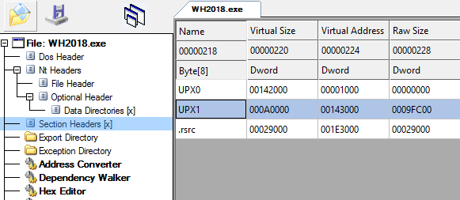

Since we know it's UPX, finding the OEP is pretty trivial. Save the file in CFF Explorer and reopen it in IDA (in 32-bit mode). For 32-bit UPX, the decompression stub begins:

```
UPX1:OEP   60                 pusha
UPX1:OEP+1 BE XX XX XX XX     mov     esi, offset dword_XXXXXXXX
UPX1:OEP+6 8D BE XX XX XX XX  lea     edi, [esi-XXXXXXXXh]
```

So searching for this pattern, we can easily find the decryption stub in WH2018.exe:


IDA reports this is at file offset 9FBC0, so to calculate the OEP we take `OEP = FO + BaseOfCode - .text[PointerToRawData] - FileAlignment = 1E28D0`. `.text[PointerToRawData]` and `FileAlignment` are [usually 0x200][4].

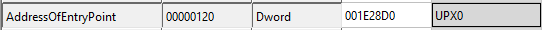

Now the entrypoint shows correctly. And we can even run it!

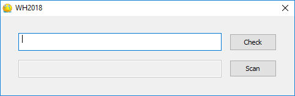

Let's decompress it now.

```
 upx394w\upx.exe -d "cock.exe"
                       Ultimate Packer for eXecutables
                          Copyright (C) 1996 - 2017
UPX 3.94w       Markus Oberhumer, Laszlo Molnar & John Reiser   May 12th 2017


        File size         Ratio      Format      Name
   --------------------   ------   -----------   -----------
   1872384 <-    823296   43.97%    win32/pe     cock.exe

Unpacked 1 file.
```

Nice. While we're at it, let's also disable the "Can Move" bit in the PE header to make debugging easier. Now we can analyze this bin proper!

## Phase 2: Patching

Since it's a AFX/MFC GUI program, it uses event-based programming which can be very annoying to locate the callback functions. Luckily, there's a x64dbg plugin [xHotSpots][2] to locate them:

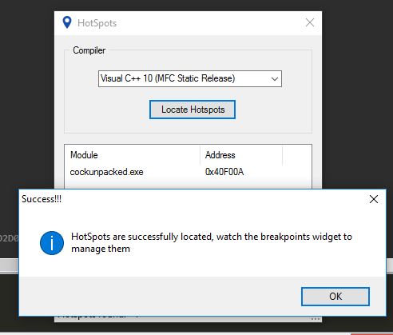

Nice! This is good. And indeed, when we click the "Check" button in the program, the breakpoint is hit.


This is an indirect jump, so of course we will just step in and then navigate to IDA.


#### Aside: Afx strings
When reversing AFX applications, a constant source of pain is the "CAfxStringMgr" class. It's basically just a smart string factory, except the struct is laid out in a strange way that the compiler emits code using negative struct offsets to reference the header fields.

The structs usually look something like this:

```C
struct CAfxStringMgr::vtable
{
  int (__stdcall *mystery0)(CAfxStringMgr *this, int);
  int (__stdcall *mystery1)(CAfxStringMgr *this);
  int (__stdcall *CAfxStringMgr::vmt1)(CAfxStringMgr *this, int, int);
  AfxString *(__thiscall *CAfxStringMgr::GetNewString)(CAfxStringMgr *this);
  int (__cdecl *mystery3)();
};
struct CAfxStringMgr
{
  CAfxStringMgr::vtable *pvft;
  AfxString nextString;
};
struct AfxString
{
  AfxString::vtable *vft;
  int len;
  int pad1;
  int refCount;
  AfxStringData s;
};
struct AfxStringData
{
  char s[];
};
struct AfxString::vtable
{
  void (__thiscall *dtor)(AfxString *this);
};
```

Using a plugin called [HexRaysPyTools][3] you can make the negative offset code look nice, but since I was in a hurry to sleep I didn't bother this time. I've also included a ripped C++ source code for the headers too.

Also, since this is Win32, there's the constant headache of Unicode vs. Multibyte vs. ASCII strings. The key fact to understand is that Unicode strings are WCHAR (16bit) strings, so each character is actually 2 bytes wide. This is an example of converting between the two types:

```C
int requiredSize = WideCharToMultiByte(0, 0, &src, -1, 0, 0, 0, 0);
WideCharToMultiByte(0, 0, &src, -1, &dst, requiredSize, 0, 0);
```

## Check 1: "Check" button
Anyways, back to the challenge. After decompiling and some cleanup, the code for the "Check" button callback looks like:

```C
// very bigdick func
void __thiscall sub_408860(BigDick *this)
{
  void *v2; // eax
  int v3; // eax
  int v4; // ebp
  void *v5; // eax
  int v6; // eax
  int v7; // edi
  const WCHAR *cmdline; // eax
  LPWSTR *argv; // esi
  volatile signed __int32 *v10; // eax
  int i; // edi
  LPWSTR argv2_strend; // eax
  int argv_strstart; // edx
  WCHAR v14; // cx
  int v15; // eax
  signed __int32 v16; // ecx
  bool v17; // zf
  bool v18; // sf
  LPWSTR v19; // ecx
  _WORD *v20; // edx
  WCHAR v21; // ax
  void *strMgr; // eax
  int *wowie; // eax
  int v24; // eax
  char *startOfStr; // esi
  WCHAR *pChar; // eax
  WCHAR curCharVal; // cx
  int requiredSize; // eax
  signed int idx; // eax
  signed int idx_1; // eax
  int v31; // eax
  signed __int32 v32; // ecx
  bool v33; // zf
  bool v34; // sf
  signed __int32 v35; // edx
  signed __int32 v36; // edx
  CWnd *v37; // ecx
  int v38; // [esp+14h] [ebp-5C0h]
  int v39; // [esp+18h] [ebp-5BCh]
  char *fuckingReturnVal; // [esp+1Ch] [ebp-5B8h]
  int pNumArgs; // [esp+20h] [ebp-5B4h]
  int wowieSrc; // [esp+24h] [ebp-5B0h]
  BigDick *v43; // [esp+28h] [ebp-5ACh]
  WCHAR checkedAgainst[35]; // [esp+2Ch] [ebp-5A8h]
  CHAR checkedAgainstSrc; // [esp+A4h] [ebp-530h]
  char v46[259]; // [esp+A5h] [ebp-52Fh]
  WCHAR srcsrc; // [esp+1A8h] [ebp-42Ch]
  char v48[518]; // [esp+1AAh] [ebp-42Ah]
  WCHAR Filename; // [esp+3B0h] [ebp-224h]
  char v50[528]; // [esp+3B2h] [ebp-222h]
  int v51; // [esp+5D0h] [ebp-4h]

  v43 = this;
  v2 = CAfxStringMgr::getInst__();
  if ( !v2 )
    throwException(-2147467259);
  v3 = (*(int (__thiscall **)(void *))(*(_DWORD *)v2 + 12))(v2);
  v4 = v3 + 16;
  v38 = v3 + 16;
  v51 = 0;
  v5 = CAfxStringMgr::getInst__();
  if ( !v5 )
    throwException(-2147467259);
  v6 = (*(int (__thiscall **)(void *))(*(_DWORD *)v5 + 12))(v5);
  v7 = v6 + 16;
  v39 = v6 + 16;
  LOBYTE(v51) = 1;
  Filename = 0;
  memset(v50, 0, 0x210u);
  GetModuleFileNameW(0, &Filename, 0x104u);
  cmdline = GetCommandLineW();
  argv = CommandLineToArgvW(cmdline, &pNumArgs);
  if ( pNumArgs != 5 )
  {
    LOBYTE(v51) = 0;
    if ( _InterlockedDecrement((volatile signed __int32 *)(v7 - 16 + 12)) <= 0 )
      (*(void (__stdcall **)(int))(**(_DWORD **)(v7 - 16) + 4))(v7 - 16);
    v51 = -1;
    v10 = (volatile signed __int32 *)(v4 - 16);
wrongLen:
    if ( _InterlockedDecrement(v10 + 3) <= 0 )
      (*(void (__stdcall **)(volatile signed __int32 *))(**(_DWORD **)v10 + 4))(v10);
    return;
  }
  i = 0;
  do                                            // print args? lol
    OutputDebugStringW(argv[i++]);
  while ( i < pNumArgs );
  memset(this->field_78, 0, 0x208u);
  memset(this->field_280, 0, 0x208u);
  memset(this->field_488, 0, 0x208u);
  memset(this->field_690, 0, 0x208u);
  OutputDebugStringW(argv[2]);
  argv2_strend = argv[2];
  argv_strstart = (int)(argv2_strend + 1);
  do                                            // strlen
  {
    v14 = *argv2_strend;
    ++argv2_strend;
  }
  while ( v14 );
  if ( ((signed int)argv2_strend - argv_strstart) >> 1 != 35 )// strlen/2 == 35, but keep in mind it's a wide char
  {
    LOBYTE(v51) = 0;
    v15 = v39 - 16;
    v16 = _InterlockedDecrement((volatile signed __int32 *)(v39 - 16 + 12));
    v17 = v16 == 0;
    v18 = v16 < 0;
wrongPW:
    if ( v18 || v17 )
      (*(void (__stdcall **)(int))(**(_DWORD **)v15 + 4))(v15);
    v51 = -1;
    v10 = (volatile signed __int32 *)(v38 - 16);
    goto wrongLen;
  }
  CreateMutexW(0, 1, L"kernel32.dll");
  if ( GetLastError() == ERROR_ALREADY_EXISTS )
    ExitProcess(0);
  v19 = argv[2];
  v20 = this->field_280;
  do
  {
    v21 = *v19;
    *v20 = *v19;
    ++v19;
    ++v20;
  }
  while ( v21 );
  strMgr = CAfxStringMgr::getInst__();
  if ( !strMgr )
    throwException(-2147467259);
  fuckingReturnVal = (char *)((*(int (__thiscall **)(void *))(*(_DWORD *)strMgr + 12))(strMgr) + 16);
  LOBYTE(v51) = 2;
  checkedAgainstSrc = 0;
  memset(v46, 0, 0x103u);
  srcsrc = 0;
  memset(v48, 0, 0x206u);
  initBigDickStr(&fuckingReturnVal);
  wowie = getWowie(&wowieSrc, argv[2]);
  LOBYTE(v51) = 3;
  strcpyProbablyidklol(&fuckingReturnVal, (void **)wowie);
  LOBYTE(v51) = 2;
  v24 = wowieSrc - 16;
  if ( _InterlockedDecrement((volatile signed __int32 *)(wowieSrc - 16 + 12)) <= 0 )
    (*(void (__stdcall **)(int))(**(_DWORD **)v24 + 4))(v24);
  startOfStr = fuckingReturnVal;
  if ( *((_DWORD *)fuckingReturnVal - 1) > 1 )
  {
    initBigDickStr2(&fuckingReturnVal, *((_DWORD *)fuckingReturnVal - 3));
    startOfStr = fuckingReturnVal;
  }
  pChar = (WCHAR *)startOfStr;
  do                                            // fucking strcpy(srcsrc, pChar)
  {
    curCharVal = *pChar;
    *(WCHAR *)((char *)pChar + (char *)&srcsrc - startOfStr) = *pChar;
    ++pChar;
  }
  while ( curCharVal );
  requiredSize = WideCharToMultiByte(0, 0, &srcsrc, -1, 0, 0, 0, 0);
  WideCharToMultiByte(0, 0, &srcsrc, -1, &checkedAgainstSrc, requiredSize, 0, 0);
  checkedAgainst[0] = 0;
  memset(&checkedAgainst[1], 0, 0x76u);
  idx = 0;
  do                                            // srcpy(checkedAgainst, checkedAgainstSrc)
  {
    checkedAgainst[idx] = *(&checkedAgainstSrc + idx);
    ++idx;
  }
  while ( idx < 50 );
  idx_1 = 0;
  do                                            // xor against 0x66
    checkedAgainst[idx_1++] ^= 0x66u;
  while ( idx_1 < 50 );
  if ( checkedAgainst[0] != '_' )
  {
    v31 = (int)(startOfStr - 16);
    LOBYTE(v51) = 1;
    v32 = _InterlockedDecrement((volatile signed __int32 *)startOfStr - 1);
    v33 = v32 == 0;
    v34 = v32 < 0;
wrongPw2:
    if ( v34 || v33 )
      (*(void (__stdcall **)(int))(**(_DWORD **)v31 + 4))(v31);
    LOBYTE(v51) = 0;
    v15 = v39 - 16;
    v35 = _InterlockedDecrement((volatile signed __int32 *)(v39 - 16 + 12));
    v17 = v35 == 0;
    v18 = v35 < 0;
    goto wrongPW;
  }
  if ( checkedAgainst[1] != '$'
    || checkedAgainst[2] != '^'
    || checkedAgainst[3] != 'W'
    || checkedAgainst[4] != '_'
    || checkedAgainst[5] != '#'
    || checkedAgainst[6] != '%'
    || checkedAgainst[7] != 'W' )
  {
    v31 = (int)(startOfStr - 16);
    LOBYTE(v51) = 1;
    v36 = _InterlockedDecrement((volatile signed __int32 *)startOfStr - 1);
    v33 = v36 == 0;
    v34 = v36 < 0;
    goto wrongPw2;
  }
  if ( checkedAgainst[8] == 'S'
    && checkedAgainst[9] == '$'
    && checkedAgainst[10] == 'R'
    && checkedAgainst[11] == '#'
    && checkedAgainst[12] == '$'
    && checkedAgainst[13] == '^'
    && checkedAgainst[14] == '\''
    && checkedAgainst[15] == 'W'
    && checkedAgainst[16] == '%'
    && checkedAgainst[17] == 'S'
    && checkedAgainst[18] == '%'
    && checkedAgainst[19] == '\''
    && checkedAgainst[20] == 'T'
    && checkedAgainst[21] == 'U'
    && checkedAgainst[22] == '_'
    && checkedAgainst[23] == 'V'
    && checkedAgainst[24] == '\''
    && checkedAgainst[25] == '#'
    && checkedAgainst[26] == 'W'
    && checkedAgainst[27] == 'R'
    && checkedAgainst[28] == '#'
    && checkedAgainst[29] == 'T'
    && checkedAgainst[30] == '^'
    && checkedAgainst[31] == '_'
    && checkedAgainst[32] == '^'
    && checkedAgainst[33] == 'Q'
    && checkedAgainst[34] == '\'' )             // 9B819EC15B4EB8A1C5CA2390AE14E28987A
  {
    v37 = (CWnd *)&v43[1].gap_0[20];
    *(_DWORD *)v43[1].gap_0 = 1;
    CWnd::EnableWindow(v37, 1);
  }
  fuckingString::dtor(&fuckingReturnVal);
  fuckingString::dtor(&v39);
  fuckingString::dtor(&v38);
}
```

In other words, it's checking if the program is passed 4 arguments (not counting argv\[0\]) and the second one must be `9B819EC15B4EB8A1C5CA2390AE14E28987A`. Notice that they create the `checkedAgainst` buffer on the fly so you can't dump it easily...lol. This startegy is used everywhere in this challenge. There are really two approaches here: you can either patch the check and bypass it or reverse the argument's required value. I chose the second option since it could be used later for printing the flag, etc.


When this new commandline is passed, the "Check" button enables the "Scan" button. The two textboxes aren't used by "Check".

## Check 2: "Scan button"

We now go back to our old magic breakpoint earlier, but now triggering it with the "Scan" button. Stepping in, we meet this *monster* of a function:

```C
void __thiscall massiveFUCKingCock(CWnd *this)
{
  void *strMgr; // eax
  char *v3; // eax
  signed __int32 v4; // ecx
  bool v5; // zf
  bool v6; // sf
  void *afxStr; // eax
  char *part2_; // eax
  int *part2__wowied; // eax
  char *v10; // eax
  char *largSrc; // edi
  WCHAR *pChar; // eax
  WCHAR v13; // cx
  int neededLen; // eax
  unsigned int lenOfStr; // ecx
  unsigned int biglyShamWOWW69; // edx
  char *topboxBase64d; // esi
  unsigned int v18; // ecx
  unsigned int v19; // edx
  signed __int32 v20; // ebp
  signed __int32 v21; // ebp
  signed int v22; // ecx
  signed int i; // eax
  signed int idx_1; // eax
  signed int idx_2; // eax
  char *topBoxxx; // eax
  const CHAR *motherFuckinNewBof; // esi
  signed int idx; // eax
  int v30; // eax
  char *fuckingAppeded; // eax
  char *fuckingAppended2; // eax
  char *msgTxt; // eax
  char *bototmBox; // [esp+14h] [ebp-A1Ch]
  char *pstr; // [esp+18h] [ebp-A18h]
  char *HYPERthonkk; // [esp+20h] [ebp-A10h]
  int topBox; // [esp+24h] [ebp-A0Ch]
  int congratulationFlagBuff[21]; // [esp+2Ch] [ebp-A04h]
  int checkedBuf[200]; // [esp+80h] [ebp-9B0h]
  char topboxHashChecked[32]; // [esp+3A0h] [ebp-690h]
  __int16 hashofTopbox[33]; // [esp+3C4h] [ebp-66Ch]
  CHAR largCockMultibyte; // [esp+408h] [ebp-628h]
  char v45; // [esp+409h] [ebp-627h]
  char topBoxConverted[260]; // [esp+50Ch] [ebp-524h]
  WCHAR largCock; // [esp+610h] [ebp-420h]
  char v48; // [esp+612h] [ebp-41Eh]
  WCHAR Caption; // [esp+818h] [ebp-218h]
  char v50; // [esp+81Ah] [ebp-216h]
  int mightyTHonkKkk; // [esp+A2Ch] [ebp-4h]

  strMgr = CAfxStringMgr::getInst__();
  if ( strMgr == 0 )
    throwException(-2147467259);
  bototmBox = (char *)((*(int (__thiscall **)(void *))(*(_DWORD *)strMgr + 12))(strMgr) + 16);
  mightyTHonkKkk = 0;
  CWnd::GetWindowTextW((int)this + 2220, (int)&bototmBox);
  if ( *((_DWORD *)bototmBox - 3) != 72 || isDebuggerPresent )// it must be 72 long
  {
    v3 = bototmBox - 16;
    mightyTHonkKkk = -1;
    v4 = _InterlockedDecrement((volatile signed __int32 *)bototmBox - 1);
    v5 = v4 == 0;
    v6 = v4 < 0;
    goto faillll;
  }
  afxStr = CAfxStringMgr::getInst__();
  if ( afxStr == 0 )
    throwException(-2147467259);
  pstr = (char *)((*(int (__thiscall **)(void *))(*(_DWORD *)afxStr + 12))(afxStr) + 16);
  LOBYTE(mightyTHonkKkk) = 1;
  largCockMultibyte = 0;
  memset(&v45, 0, 0x103u);
  largCock = 0;
  memset(&v48, 0, 0x206u);
  initBigDickStr(&pstr);
  part2_ = bototmBox;
  if ( *((_DWORD *)bototmBox - 1) > 1 )
  {
    initBigDickStr2(&bototmBox, *((_DWORD *)bototmBox - 3));
    part2_ = bototmBox;
  }
  part2__wowied = getWowie((int *)&HYPERthonkk, (const unsigned __int16 *)part2_);
  LOBYTE(mightyTHonkKkk) = 2;
  strcpyProbablyidklol(&pstr, (void **)part2__wowied);
  LOBYTE(mightyTHonkKkk) = 1;
  v10 = HYPERthonkk - 16;
  if ( _InterlockedDecrement((volatile signed __int32 *)HYPERthonkk - 1) <= 0 )
    (*(void (__stdcall **)(char *))(**(_DWORD **)v10 + 4))(v10);
  largSrc = pstr;
  if ( *((_DWORD *)pstr - 1) > 1 )
  {
    initBigDickStr2(&pstr, *((_DWORD *)pstr - 3));
    largSrc = pstr;
  }
  pChar = (WCHAR *)largSrc;
  do
  {                                             // strcpy(largCock, largSrc)
    v13 = *pChar;
    *(WCHAR *)((char *)pChar + (char *)&largCock - largSrc) = *pChar;
    ++pChar;
  }
  while ( v13 );
  neededLen = WideCharToMultiByte(0, 0, &largCock, -1, 0, 0, 0, 0);
  WideCharToMultiByte(0, 0, &largCock, -1, &largCockMultibyte, neededLen, 0, 0);
  lenOfStr = strlen(&largCockMultibyte);
  biglyShamWOWW69 = 3 * (lenOfStr / 3);
  if ( lenOfStr != biglyShamWOWW69 )
    lenOfStr = biglyShamWOWW69 + 3;
  topboxBase64d = (char *)malloc(8 * lenOfStr / 6 + 1);
  v18 = strlen(&largCockMultibyte);
  v19 = 3 * (v18 / 3);
  if ( v18 != v19 )
    v18 = v19 + 3;
  malloc(8 * v18 / 6 + 1);
  if ( !topboxBase64d )                         // check alloc success
  {
    LOBYTE(mightyTHonkKkk) = 0;
    if ( _InterlockedDecrement((volatile signed __int32 *)largSrc - 1) <= 0 )
      (*(void (__stdcall **)(char *))(**((_DWORD **)largSrc - 4) + 4))(largSrc - 16);
    goto fail;
  }
  base64ProbablyLol(topboxBase64d, (int)&largCockMultibyte, strlen(&largCockMultibyte));
  if ( strlen(topboxBase64d) != 96 )            // len must = 96
  {
    LOBYTE(mightyTHonkKkk) = 0;
    if ( _InterlockedDecrement((volatile signed __int32 *)largSrc - 1) <= 0 )
    {
      (*(void (__stdcall **)(char *))(**((_DWORD **)largSrc - 4) + 4))(largSrc - 16);
      mightyTHonkKkk = -1;
      v3 = bototmBox - 16;
      v21 = _InterlockedDecrement((volatile signed __int32 *)bototmBox - 1);
      v5 = v21 == 0;
      v6 = v21 < 0;
faillll:
      if ( v6 || v5 )
        (*(void (__stdcall **)(char *))(**(_DWORD **)v3 + 4))(v3);
      return;
    }
fail:
    mightyTHonkKkk = -1;
    v3 = bototmBox - 16;
    v20 = _InterlockedDecrement((volatile signed __int32 *)bototmBox - 1);
    v5 = v20 == 0;
    v6 = v20 < 0;
    goto faillll;
  }
  checkedBuf[0] = 0;
  memset(&checkedBuf[1], 0, 0x31Cu);            // really its 0x320 since we already did 4
  v22 = strlen(topboxBase64d);
  for ( i = 0; i < v22; ++i )
    checkedBuf[i] = topboxBase64d[i];
  idx_1 = 0;
  do
  {
    topboxBase64d[idx_1] ^= 0x60u;              // xor with 0x60
    ++idx_1;
  }
  while ( idx_1 < 96 );
  if ( CheckFunc1(checkedBuf) && CheckFunc2(&checkedBuf[32]) && Check3(&checkedBuf[64]) )// fucK
  {                                             // check3 = MjY4RTI1QTE0RkIxRENDOTIzODcwQzA1 = 268E25A14FB1DCC923870C05
    idx_2 = 0;                                  // check1 = QUQ5OThENEYxQjQxMEY4Q0VCNEFBNzRF = AD998D4F1B410F8CEB4AA74E
                                                // check2 = MTQ0RDIxOUVGNUI5NDU5REE4RTFEMDNC = 144D219EF5B9459DA8E1D03B
    do
    {                                           // undo the xor???
      topboxBase64d[idx_2] ^= 0x60u;
      ++idx_2;
    }
    while ( idx_2 < 96 );
    *((_DWORD *)this + 551) = 1;
    maekNewStrang(&topBox);
    LOBYTE(mightyTHonkKkk) = 3;
    CWnd::GetWindowTextW((int)this + 2304, (int)&topBox);
    if ( *(_DWORD *)(topBox - 12) == 8 && !NtQueryInformationProcess )// len = 8
    {
      topBoxConverted[0] = 0;
      memset(&topBoxConverted[1], 0, 0x103u);
      hashofTopbox[0] = 0;
      memset(&hashofTopbox[1], 0, 0x40u);
      topboxHashChecked[0] = 0;                 // init new afx string
      *(_DWORD *)&topboxHashChecked[1] = 0;
      *(_DWORD *)&topboxHashChecked[5] = 0;
      *(_DWORD *)&topboxHashChecked[9] = 0;
      *(_DWORD *)&topboxHashChecked[13] = 0;
      *(_DWORD *)&topboxHashChecked[17] = 0;
      *(_DWORD *)&topboxHashChecked[21] = 0;
      *(_DWORD *)&topboxHashChecked[25] = 0;
      *(_DWORD *)&topboxHashChecked[29] = 0;
      topBoxxx = thonk((char **)&topBox);
      convertStringType(topBoxConverted, (const WCHAR *)topBoxxx);
      md5hashShitGetDigest((BYTE *)topBoxConverted, hashofTopbox);
      convertStringType(topboxHashChecked, (const WCHAR *)hashofTopbox);
      if ( !checkDaFlagggsHash((int)topboxHashChecked) )// 3AB47284CF7E260541D810BEB54D3405 -> whitehat
        ExitProcess('\0');
      congratulationFlagBuff[0] = 'C';
      congratulationFlagBuff[1] = 'O';
      congratulationFlagBuff[2] = 'N';
      congratulationFlagBuff[3] = 'G';
      congratulationFlagBuff[4] = 'R';
      congratulationFlagBuff[5] = 'A';
      congratulationFlagBuff[6] = 'T';
      congratulationFlagBuff[7] = 'U';
      congratulationFlagBuff[8] = 'L';
      congratulationFlagBuff[9] = 'A';
      congratulationFlagBuff[10] = 'T';
      congratulationFlagBuff[11] = 'I';
      congratulationFlagBuff[12] = 'O';
      congratulationFlagBuff[13] = 'N';
      congratulationFlagBuff[14] = '\0';
      congratulationFlagBuff[15] = '\r';
      congratulationFlagBuff[16] = '\0';
      congratulationFlagBuff[17] = 'F';
      congratulationFlagBuff[18] = 'L';
      congratulationFlagBuff[19] = 'A';
      congratulationFlagBuff[20] = 'G';
      motherFuckinNewBof = (const CHAR *)operator new[](0x16u);
      Caption = 0;
      memset(&v50, '\0', 0x206u);
      if ( motherFuckinNewBof )
      {
        idx = 0;
        do
        {
          motherFuckinNewBof[idx] = LOBYTE(congratulationFlagBuff[idx]) + 32;
          ++idx;
        }
        while ( idx < 21 );
        *((_BYTE *)motherFuckinNewBof + 21) = '\0';
        v30 = MultiByteToWideChar('\0', '\0', motherFuckinNewBof, -1, (LPWSTR)'\0', '\0');
        MultiByteToWideChar('\0', '\0', motherFuckinNewBof, -1, &Caption, v30);
        maekNewStrang(&HYPERthonkk);
        LOBYTE(mightyTHonkKkk) = 4;
        if ( !checkDebugregs() )
        {
          initBigDickStr(&HYPERthonkk);
          strcattt((int *)&HYPERthonkk, (wchar_t *)this + 320);
          strcattt((int *)&HYPERthonkk, L"+");
          fuckingAppeded = thonk((char **)&topBox);
          strcattt((int *)&HYPERthonkk, (wchar_t *)fuckingAppeded);
          strcattt((int *)&HYPERthonkk, L"+");
          fuckingAppended2 = thonk(&bototmBox);
          strcattt((int *)&HYPERthonkk, (wchar_t *)fuckingAppended2);
          msgTxt = thonk(&HYPERthonkk);
          CWnd::MessageBoxW(this, (LPCWSTR)msgTxt, &Caption, '\0');
          ExitProcess('\0');
        }
        fuckingString::dtor(&HYPERthonkk);
      }
    }
    fuckingString::dtor(&topBox);
  }
  fuckingString::dtor(&pstr);
  fuckingString::dtor(&bototmBox);
}
```

This function checks both the upper and lower input textfields, and it does three separate checks on the bottom field. There's also several anti-debugging mechanisms. I'll discuss each of these below.

### Anti-debug

The anti-debug is actually coded wrong so it's impossible to solve this "legitimately" without patching the bin...lol

- **Check 1**: Line 179, `.. && !NtQueryInformationProcess)` This is wrong; it's just checking that the function pointer is nonnull...which it always is. This check must be patched.
- **Check 2**: Line 238, `if ( !checkDebugregs() )` This is actually correct. It only passes if all of the DRX registers are zero using `GetThreadContext`. Easily bypassed using ScyllaHide plugin, though: 
- **Check 3**: Line 62, `... || isDebuggerPresent )` Another broken check a la Check #1 above. The function actually works (using `CheckRemoteDebuggerPresent`), however it's bypassable easily by hiding from PEB anyways.
- **Check 4**: `checkDaFlagggsHash`, `IsDebuggerPresent()` This is a standard `IsDebuggerPresent` check and you can bypass it by hiding from PEB.

To deal with these, I just used x64dbg's *excellent* built-in patching functionality:

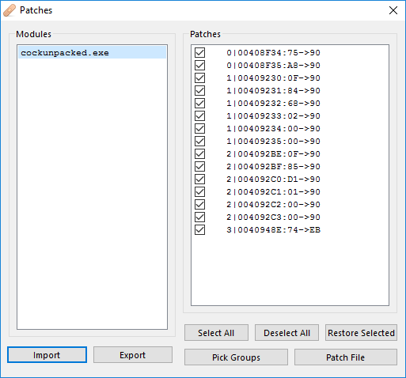

### Upper textfield

The checking code for the upper textfield boils down to:

```C
maekNewStrang(&topBox);
CWnd::GetWindowTextW(this + 2304, (int)&topBox);
memset(topBoxConverted, 0, 0x104);
memset(hashofTopbox, 0, 0x42u);
memset(topboxHashChecked, 0x20)
topBoxxx = thonk(&topBox);
convertStringType(topBoxConverted, topBoxxx);
md5hashShitGetDigest(topBoxConverted, hashofTopbox);
convertStringType(topboxHashChecked, hashofTopbox);
if ( !checkDaFlagggsHash(topboxHashChecked) )// 3AB47284CF7E260541D810BEB54D3405 -> whitehat
    ExitProcess('\0');
```

`checkDaFlagggsHash` checks if the hash is `3AB47284CF7E260541D810BEB54D3405`, which is easily cracked at CrackStation to be `whitehat`.

### Lower textfield, part 1

Before the lower textfield's value is passed into any of the checking subroutines, it base64 encodes it. With that in mind, let's look at `CheckFunc1`. sampriti solved this section using z3, but I'll discuss a better way later in part 3. If you look at the function, it looks basically like:

```C
signed int __stdcall CheckFunc1(const void *a1)
{
  qmemcpy(&v3, a1, 0x80u);
  int v1, v3, v4, v5, /* ... */ v34;
  v1 = 0;
  while ( 1467 * v4
        + 1464 * v12
        + 1491 * v18
        + 1961 * v17
        + 2169 * v7
        + 2145 * v14
        + 3358 * v10
        + 3281 * v15
        + 3500 * v6
        + 3478 * v9
        + 3391 * v23
        + 3436 * v22
        + 3705 * v13
        + 3604 * v24
        + 1153 * v26
        + 3962 * v11
        + 3942 * v20
        + 1292 * v27
        + 3995 * v19
        + 1382 * v28
        + 1716 * v30
        + 1726 * v34
        + 1902 * v25
        + 2718 * v31
        + 2895 * v32
        + 3421 * v29
        + 3447 * v33
        + 2827 * (v21 + v16)
        + 1724 * v8
        + 1334 * v5
        + 1041 * v3 == 6528434
       && 1644 * v22
// .. 31 more of these checks
{
    if ( ++v1 >= 10 )
      return 1;
  }
  return 0;
}
```

It's essentially a system of 32 linear equations of 32 variables over the finite field `GF(2^32)`. Though to be fair, there is no overflow so you can just think about it in terms of `Z`. Z3 gets the job done but it's a little overkill :P

Anyways, it expects the value passed in to be `QUQ5OThENEYxQjQxMEY4Q0VCNEFBNzRF`. Otherwise it hangs.

## Check part 2

Now let's look at `CheckFunc2`. It's essentially xor's the input against a dynamically generated key and checks the output. This might be RC4 but I'm not sure.

```C
signed int __stdcall CheckFunc2(int *checkedBuf)
{
  signed int idx; // eax
  char checkedAgainstChars[14]; // esi
  signed int idx_1; // eax
  int checkedAgainstInt[13]; // [esp+8h] [ebp-278h]
  Ccrc_t crc; // [esp+3Ch] [ebp-244h]
  char bufCpy[32]; // [esp+258h] [ebp-28h]

  idx = 0;
  bufCpy[0] = 0;
  *(_DWORD *)&bufCpy[1] = 0;
  *(_DWORD *)&bufCpy[5] = 0;
  *(_DWORD *)&bufCpy[9] = 0;
  *(_DWORD *)&bufCpy[13] = 0;
  *(_DWORD *)&bufCpy[17] = 0;
  *(_DWORD *)&bufCpy[21] = 0;
  *(_DWORD *)&bufCpy[25] = 0;
  *(_DWORD *)&bufCpy[29] = 0;
  do
  {
    bufCpy[idx] = checkedBuf[idx];              // strcpy
    ++idx;
  }
  while ( idx < 32 );
  checkedAgainstInt[0] = 'f';
  checkedAgainstInt[1] = 'h';
  checkedAgainstInt[2] = 'n';
  checkedAgainstInt[3] = 'j';
  checkedAgainstInt[4] = 'u';
  checkedAgainstInt[5] = 'c';
  checkedAgainstInt[6] = 'v';
  checkedAgainstInt[7] = 'b';
  checkedAgainstInt[8] = 'n';
  checkedAgainstInt[9] = 'j';
  checkedAgainstInt[10] = 'u';
  checkedAgainstInt[11] = 't';
  checkedAgainstInt[12] = 'r';
  *(_DWORD *)checkedAgainstChars = operator new[](14u);
  idx_1 = 0;
  if ( !*(_DWORD *)checkedAgainstChars )
    return idx_1;
  do
  {
    *(_BYTE *)(idx_1 + *(_DWORD *)checkedAgainstChars) = LOBYTE(checkedAgainstInt[idx_1]) + 1;
    ++idx_1;
  }
  while ( idx_1 < 13 );
  *(_BYTE *)(*(_DWORD *)checkedAgainstChars + 13) = 0;
  xor.pvft = &CRC4::`vftable';                  // rc4 shit is NOT fucking used
  memset(xor.indexes, 0, 0x100u);
  memset(xor.checkedAgainst, 0, 0x100u);
  decodeShitXor(bufCpy, &crc, *(const char **)checkedAgainstChars);
  do
  {
    while ( bufCpy[0] != 199 )                  // will hang if first char isn't 0xc7
      ;
  }
  while ( bufCpy[1] != 0x3C
       || bufCpy[2] != 0x12
       || bufCpy[3] != 9
       || bufCpy[4] != 7
       || bufCpy[5] != 0x8Eu
       || bufCpy[6] != 0x88u
       || bufCpy[7] != 0xB9u
       || bufCpy[8] != 0x18
       || bufCpy[9] != 0x94u
       || bufCpy[10] != 0x4B
       || bufCpy[11] != 0x6D
       || bufCpy[12] != 0x13
       || bufCpy[13] != 0x15
       || bufCpy[14] != 0x81u
       || bufCpy[15] != 0x5C
       || bufCpy[16] != 0xA5u
       || bufCpy[17] != 0xC7u
       || bufCpy[18] != 0xD
       || bufCpy[19] != 0x23
       || bufCpy[20] != 0xEFu
       || bufCpy[21] != 0x45
       || bufCpy[22] != 0xECu
       || bufCpy[23] != 0xC9u
       || bufCpy[24] != 0xB1u
       || bufCpy[25] != 5
       || bufCpy[26] != 0xB6u
       || bufCpy[27] != 132
       || bufCpy[28] != 0x37
       || bufCpy[29] != 0x63
       || bufCpy[30] != 0xDEu
       || bufCpy[31] != 0xA5u );
  idx_1 = 1;
  return idx_1;
}
```

The key here is `decodeShitXor`. Take a look:

```C
// note: there is 
struct __declspec(align(4)) Xor_t
{
  void *pvft;
  char indexes[256];
  char checkedAgainst[256];
  int xorKey;
  int idx;
  int idx0;
  int idx1;
  int idx2;
  int length;
};

const char *__userpurge decodeShitXor@<eax>(const char *inout@<ebx>, Xor_t *xor@<esi>, const char *checkedAgainst)
{
  int v3; // eax
  char *v4; // ecx
  int v5; // eax
  int inoutLen; // eax
  int nextXorKey; // eax
  int v8; // ecx
  const char *curInoutChar; // ecx

  xor->idx1 = 0;
  xor->idx2 = 0;
  xor->idx0 = 0;
  xor->idx = 0;
  xor->length = strlen(checkedAgainst);
  do
  {
    xor->checkedAgainst[xor->idx] = checkedAgainst[xor->idx % xor->length];
    xor->indexes[xor->idx] = xor->idx;
    ++xor->idx;
  }
  while ( xor->idx < 256 );
  xor->idx = 0;
  do
  {
    v3 = xor->idx;
    v4 = (char *)xor + v3;
    v5 = (xor->idx0 + (unsigned __int8)xor->indexes[v3] + (unsigned __int8)xor->checkedAgainst[v3]) & 0xFF;
    xor->idx0 = v5;
    v4[4] ^= xor->indexes[v5];
    xor->indexes[xor->idx0] ^= xor->indexes[xor->idx];
    xor->indexes[xor->idx++] ^= xor->indexes[xor->idx0];
  }
  while ( xor->idx < 256 );
  inoutLen = strlen(inout);
  xor->idx = 0;
  for ( xor->length = inoutLen; xor->idx < xor->length; inout[xor->idx++] ^= LOBYTE(xor->xorKey) )
  {
    nextXorKey = (unsigned __int8)(xor->idx1 + 1);
    xor->idx1 = nextXorKey;
    v8 = (xor->idx2 + (unsigned __int8)xor->indexes[nextXorKey]) & 0xFF;
    xor->idx2 = v8;
    xor->indexes[nextXorKey] ^= xor->indexes[v8];
    xor->indexes[xor->idx2] ^= xor->indexes[xor->idx1];
    xor->indexes[xor->idx1] ^= xor->indexes[xor->idx2];
    LOBYTE(nextXorKey) = xor->indexes[(unsigned __int8)(xor->indexes[xor->idx1] + xor->indexes[xor->idx2])];
    curInoutChar = &inout[xor->idx];
    LOBYTE(xor->xorKey) = nextXorKey;
    if ( (unsigned __int8)nextXorKey == *curInoutChar )
      LOBYTE(xor->xorKey) = 0;
    if ( !isalnum(*curInoutChar) )
      break;
  }
  return inout;
}
```

Now, the astute reader ma-- screw that, nobody is going to actually read this crap anyways. The key observation is that the rolling xor key doesn't depend whatsoever on the input value, so we can just dump the key from the debugger and decrypt it "checked against" value to get the correct input. To do that, I used x64dbg's great "breakpoint logging" feature.

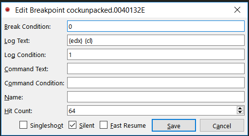

And it nicely prints out the key for us:

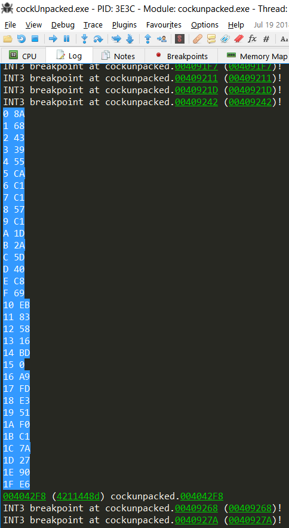

It's trivial to get the correct input, which happens to be `MTQ0RDIxOUVGNUI5NDU5REE4RTFEMDNC`.

## Check part 3

Part 3 is more of the linear equations from Part 1. As promised earlier, the better way of solving this is to recognize that since it's just a system of 32 linear equations of 32 variables, we can represent this using a 32x32 square matrix, and do some basic linear algebra to solve the system. To do that, I just parsed the decompiled code and used Numpy:

```python
mtx = ... # parsed stuff
v = ... # parsed stuff
imtx=np.linalg.inv(mtx)
dumbass=imtx.dot(v)
dumbass = np.rint(dumbass).astype(np.int)
asdgasdgasd = ''
for c in dumbass:
    asdgasdgasd += chr(c)
print asdgasdgasd
```

The correct input was `MjY4RTI1QTE0RkIxRENDOTIzODcwQzA1`.

## Putting it all together

*Finally* we can assemble all the parts of our puzzle: the cmdline, the patches, the top box, and the 3 parts of the bottom box. Recalling that the bottom box's value was base64ed before checking, we need to base64decode our respective check functions' correct inputs to get the real required input for the bottom box. It is `144D219EF5B9459DA8E1D03B144D219EF5B9459DA8E1D03B268E25A14FB1DCC923870C05`. The top box was `whitehat`, and the commandline was `WH2018.exe 1 9B819EC15B4EB8A1C5CA2390AE14E28987A 3 4`.


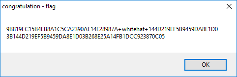

Hooray.

[1]: https://ntcore.com/?page_id=388
[2]: https://github.com/ThunderCls/xHotSpots
[3]: https://github.com/igogo-x86/HexRaysPyTools
[4]: http://en.redinskala.com/finding-the-ep/
