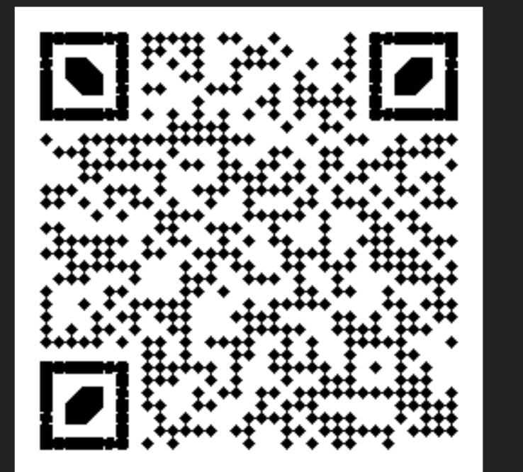

WhiteHat GrandPrix 06 - Misc 2
==============================


Hoi An is colorful ancient town, right?

http://52.78.210.118/Trip_to_Hoi_An.png

Hints

The embedded data is encrypted using AES.

Writeup
-------

First, we download the image. It is a beautiful image in Vietnam:


We immediately notice that there is data appended to the end of the image, by searching for `IEND`:


This means there is another png file appended to our image. We also see the comment in the first image, stating: 

```
Find the password to get the colors using stego tool
```

Extracting the second png, we get this image:


This is a weird QR code. After filtering it to black and white, we get:



With the power of QR scanners like Snapchat, we are able to decode this, and it says:

```
VGhlIHBhc3N3b3JkIGZvciB0aGlzIHBpY3R1cmUgaXM6IFJHQg==
```

or `'The password for this picture is: RGB'`.

From here, we spent a day trying to find which stego tool was used to hide data, and we eventually found that the correct tool was "Stegosuite." Using the latest version of stegosuite, we are able to extract data from the image:

```
root@4aa2f718fd26:/# stegosuite -x -d  -k RGB Trip_to_Hoi_An.png    
Loading png image from /Trip_to_Hoi_An.png
07:55:30.405 @ main (PNGImage.java:27) Width, height, type: 1440*810*5
Extracting data...
07:55:30.435 @ main (PNGLsbMultiColorChannel.java:128) Performing PNG LSB extraction
07:55:30.766 @ main (PayloadExtractor.java:145) Payload of 117 bytes to be extracted
07:55:30.769 @ main (PayloadExtractor.java:83) Unpacking payload from 117 extracted bytes
07:55:31.168 @ main (PayloadExtractor.java:104) Unpacked 106 bytes of payload
Extracting completed
Extracted message: Here is your colors:
1196,152
818,504
167,465
1424,680
786,309
448,383
1198,302
187,43
341,280
27,477
```

It seems that the colors at these coordinates in the image will give us the flag.

Writing a quick solve script:

```python
from PIL import Image

ps = []
with open("colors") as f:
    for line in f:
        ps.append(tuple(map(int, line.strip().split(','))))

t = Image.open("Trip_to_Hoi_An.png")
pix = t.load()
vs = []
for x, y in ps:
    print(pix[x,y])
    vs += list(pix[x,y])

print(bytes(vs))
```

Gives:

```
(119, 51, 76)
(67, 48, 109)
(51, 95, 116)
(48, 95, 72)
(79, 73, 95)
(65, 78, 95)
(52, 110, 99)
(49, 51, 110)
(116, 95, 116)
(48, 119, 110)
[119, 51, 76, 67, 48, 109, 51, 95, 116, 48, 95, 72, 79, 73, 95, 65, 78, 95, 52, 110, 99, 49, 51, 110, 116, 95, 116, 48, 119, 110]```

Which gives us the flag.

```python
>>> ''.join([chr(i) for i in [119, 51, 76, 67, 48, 109, 51, 95, 116, 48, 95, 72, 79, 73, 95, 65, 78, 95, 52, 110, 99, 49, 51, 110, 116, 95, 116, 48, 119, 110]])
'w3LC0m3_t0_HOI_AN_4nc13nt_t0wn'
```

Flag: `w3LC0m3_t0_HOI_AN_4nc13nt_t0wn`